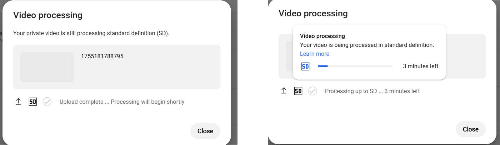
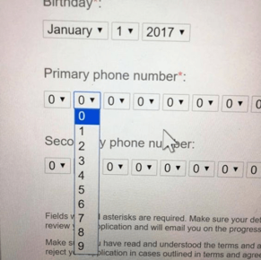
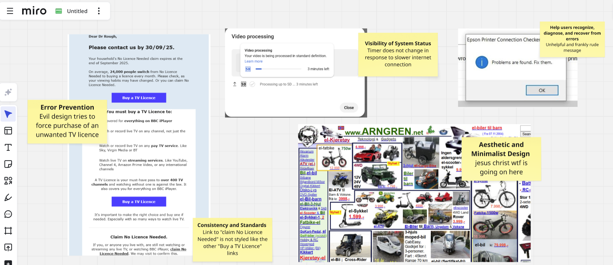

# Lab 1 - Heuristic Evaluation

This lab is to get you started on your first assignment - the heuristic evaluation of a piece of software chosen by your group.

## What you need to do

1. Get into your teams (if you haven't confirmed a team yet, don't worry - you can do this individually) and get familiar with each of the 10 heuristics. Browse some of the sites or apps you commonly use (either on desktop or mobile) and try and identify a way in which a heuristic is applied well, or violated.

For example, for "Visibility of System Status", when you add an item to your shopping cart, does it immediately show this? When you click on something that takes time to load, does it show a progress bar?

If possible, take a screenshot of the good/bad design so that you can collect examples together of what to look for. For example, when I uploaded the video of Betsy to YouTube, the screen on the left was showing for a while without any indication of when 'shortly' would be. 

Then, it got stuck processing at '3 minutes' for about half an hour before I realised that there was a problem with my internet connection. It should have communicated the slower processing time to me - this is poor visibility of system status!

Another useful method is to search for "bad usability" and see what images come up. For example, what heuristics (if any) does this violate?

I have my own opinion, but I'd be interested to know yours!

> :memo: **Note:** It's usually easier to find examples of good practice rather than bad practice (unless you're evaluating SEAtS or whatever) but that's okay! The important thing is that you can identify them.

## Conducting the Heuristic Evaluation

2. Individually: 
    - Go off (this might be outside of the labs), use the device/system, and evaluate it according to Nielsen’s 10 heuristics individually. 
    - Firstly get a feel for the flow and scope of the system. Secondly focus on specific elements. 
    - Produce a list of problems: for each problem, list the issue, severity rating, heuristic violated and description.
    - You should also look for examples where the heuristics have been applied successfully. 
    - You might find that some heuristics come up more frequently than others. This is okay too - you don't have to try and find the same number of each.

3. Once you've conducted an individual evaluation, join up with your team again and discuss your findings.
    - Consider how the problems might be fixed and which ones you would
recommend fixing to a developer.
    - Aggregate your findings; which did you have in common and which were rarer?

## Tools you can use
You can record good/bad examples of Nielsen's heuristics any way that you like. My personal preference is [Miro](https://www.miro.com) - Miro is an online workspace application that's basically like a virtual whiteboard. You can add screenshots and annotate them with virtual sticky notes to explain which of the heuristics are represented. 

## Once you're done
4. Individually, reflect on the methodology (process) you’ve used. For example:
    - How many of your findings did you have in common?
    - Were some of the findings obvious (found by everyone) and others less so (only found by a few)? Was one of the evaluators obviously better? In what way?
    - Did it enhance the methodology to do it independently and then together? Could you improve the methodology?
    - Would it have been useful to collaborate with more evaluators? How many would be optimal?

5. Begin to produce your individual report for the Assignment 1 submission.