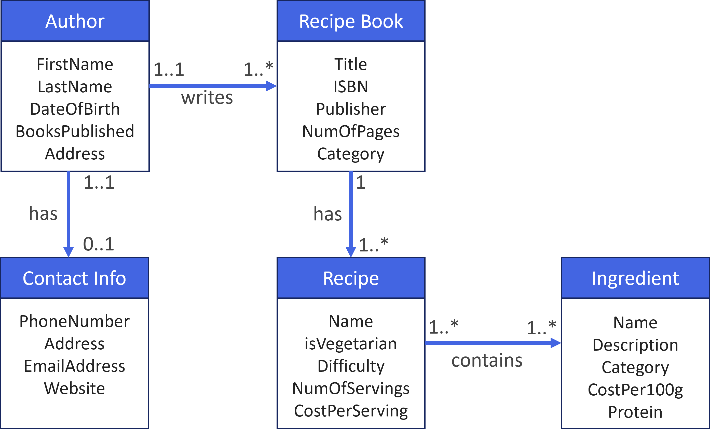

# Lab 1 - Desigining an E-R Diagram

This lab is to give you practice in designing a relational database, and drawing an entity-relationship (E-R) diagram to represent this design.

## What you need to do

Create an E-R model to encompass the following situation:
- A large organisation has several parking areas, which are used by staff
- Each parking area has a unique name, location, capacity and number of floors
- Each parking area has parking spaces, which are uniquely identified by a space number
- Members of staff can request the use of a parking space; each member of staff has a unique staff number, name and phone extension number

You'll need to think about the following:
1. What are the **entities** in this scenario?
2. What **attributes** will these entities have, and what are their types?
3. Which of these attributes will make a good **Primary Key**?
4. What kinds of **relationships** will exist between the entities (e.g., one-to-many, many-to-many, one-to-one)

*Note that this description leaves out a lot of details, so you should make your own assumptions about how it should be modelled. These can later be clarified with the client*

## Tools you can use

You are not limited to any specific tool, but here are some that I like:

- [Microsoft Visio](https://www.microsoft.com/en-gb/microsoft-365/visio/flowchart-software) - Visio is a diagramming application that you should be able to access through your university credentials
- [diagrams.net](https://app.diagrams.net/) - diagrams.net is similar to Viso - it allows you to create diagrams and flowcharts, and export them in different file formats
- [Visual Paradigm](https://www.visual-paradigm.com/) - Visual Paradigm is a more advanced tool that you should be able to access through Apps Anywhere (the university has a subscription so you don't have to pay for it yourself)
- [Miro](https://www.miro.com) - Miro is an online workspace application that includes tools for diagramming and flowcharts.
- [MySQL Workbench](https://www.mysql.com/products/workbench/) - this is the application we'll be using over the next couple of weeks so it's a good idea to get familiar with it anyway.

You're also free to use anything else such as PowerPoint or pen and paper!

## Anything to submit?
There's no mandatory submission here. I'll be coming around the lab to check how everyone is doing, but if you want additional feedback, feel free to email your diagram to me at drough001@dundee.ac.uk. 

## Anything else?

If you're done with that and want some more practice (it's all helpful for your first assignment!), try the following:

Create an E-R model to encompass the following situation:
- A university requires a database to store information about its applicants, current students and graduates; this will be accessible to both staff and students
- Students are associated with a single programme of study which consists of a number of modules
- The modules may form part of multiple programmes
- The modules are taught by one (or multiple) members of staff
- Timetabling and room allocation is being done separately so does not need to be included
