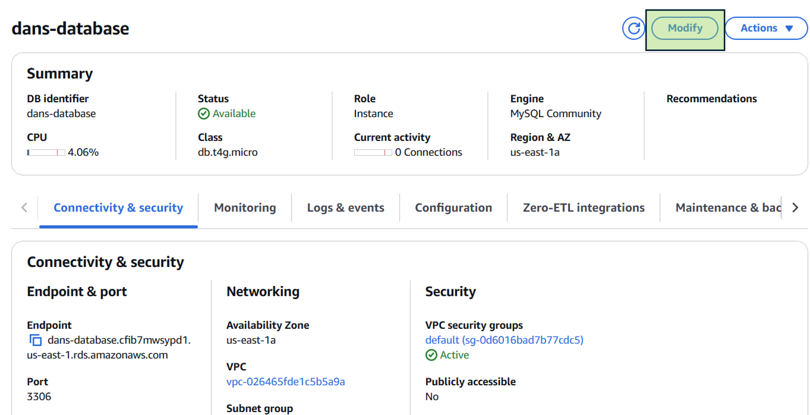
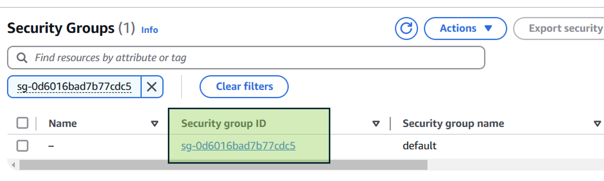
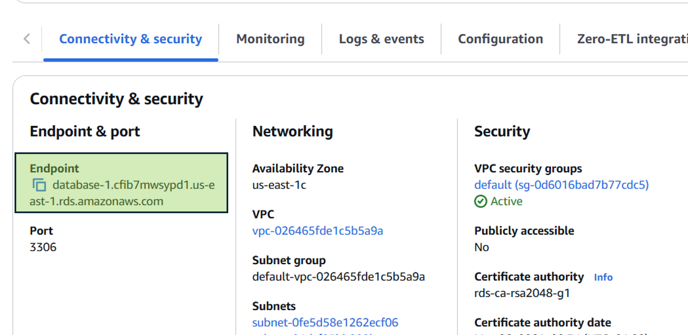

# Lab 2 - Setting up an SQL database with AWS

This is a guide to setting up a database on AWS that can store your MySQL database in the cloud! You should have received an email with instructions on creating your AWS Learner Lab account. Once you've logged in and connected to the Learner Lab, there are quite a few steps to go through, but hopefully this step-by-step guide helps you along!

## Step 1 - Launch the AWS Learner Lab

First, click on "Launch AWS Learner Lab"

You should then see a new screen with the options below. Click on "Start Lab" as highlighted.

You'll need to wait a few seconds (sometimes a few minutes) but eventually the light on the AWS link will turn from red to green. Once this is done, click on the link.

This will then take you to the AWS Management Console. To find the Relational Database service that you need, open the search bar at the top, type "RDS" and select the first option that appears.

## Step 2 - Create a new database
You'll then be on the RDS console. To create a new database, click the "Create database" button as below (but I guess you probably worked that out already).

Now, there are a few options to select to make sure you don't mess things up, so proceed gently.

1. In the "Choose a database creation method", select **Full configuration**
2. In the "Configuration" section, select **MySQL**
3. In the "Engine version" bit, select **MySQL 8.0.40** (the default version misbehaves with MySQL Workbench)

3. In the "Templates" section, select **Sandbox**

4. Give your database instance a name. By default it'll be 'database-1' but you can change it to whatever you like.
5. In the 'Master username' section, the default is 'admin'. You can change it, but **make sure you remember what you changed it to!**
6. In the "Credentials management" section, select **Self managed**, then you can choose whether to auto-generate a password, or choose your own. 

Scroll right down to the bottom and click the "Create database" button at the bottom of the screen.

## Step 3 - Configure the database to work with MySQL Workbench

You'll be returned to the screen showing your existing databases. In the case below, I've got one database that's "Available" and the one I've just created, that says **Creating**. This will take a couple of minutes (probably a bit longer) but eventually the "Creating" status will change to **Backing Up** and finally **Available**. Once this has happend, click on the name of your newly created database.

Now click on the **Modify** button in the top-right corner to make your database publicly accessible.

Scroll down to the **Connectivity** section, click **Additional Configuration** and make sure that **Publicly accessible** is selected. Click "Continue" at the bottom, then "Modify DB instance" on the next page.

You then need to configure the security rules so that you're able to access your database from whatever machine you're on. Go back to the main page, select **Endpoints** and then click on the link under **VPC security groups**

Then click on the **Security group ID** link

Click on the **Edit inbound rules** button

There will already be a rule there. Sometimes it works, but just to be sure, it's best to remake it from scratch. First, click the **Delete** button, and then the **Add rule** button.

In the "Type" dropdown, make sure that you select **MYSQL/Aurora**, and in the "Source" dropdown, make sure that **Anywhere-IPv4** is selected. Click "Save rules" and you're all done.

## Step 4 - Connect to the database through MySQL Workbench
To return to the main console, the easiest way is to press and hold the Back button in your browser, and select the RDS option.

Copy the "Endpoint" on the main console - you'll need this for connecting to your database.

Open up MySQL Workbench (if you're not working on a lab machine, you can download it from [this link here](https://www.mysql.com/products/workbench/)), and then click the + icon next to "MySQL Connections"

In the "Hostname" section, paste in the endpoint you copied in the previous step. The Username should be "admin" unless you changed it in Step 2.

Click on "Test Connection", enter your password, and hopefully you get the message below! If you don't (either an error message, or it stops responding) then you might have missed one of the steps above. Make sure your database is publicly accessible, and that you configured the security rule correctly.

Finally, if all is well, you can click OK, and then double-click on the new connection that has appeared under "MySQL connections".  
Well done! You're now ready to start [Lab 2](/lab-3-sql.md).

