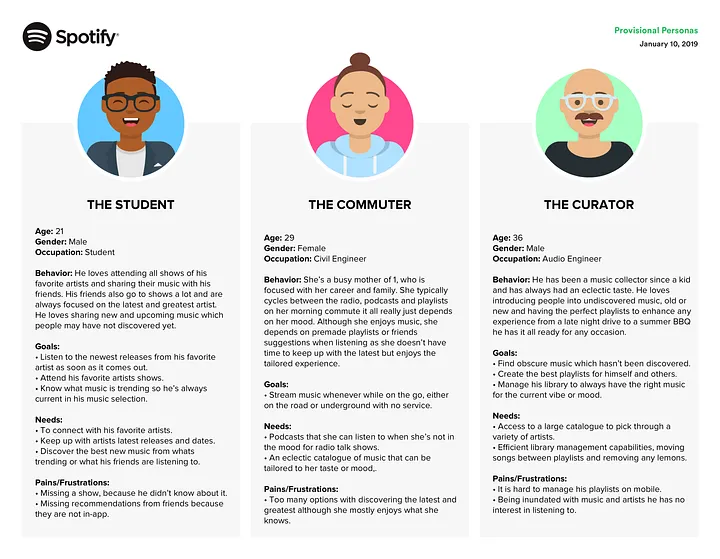

# Lab 3 - Persona Development
Good morning! 

While I've mentioned that the usefulness of personas depend on doing user research to base these personas on 'real users', we can also develop [ad-hoc personas](https://jnd.org/ad-hoc-personas-empathetic-focus/), also known as [proto-personas](https://www.nngroup.com/articles/persona-types/), without any new user research. These are based on your own existing knowledge and assumptions.

The purpose of a persona is to build **empathy** with potential users. By focusing on archetypes of typical user groups, rather than just the amorphous concept of "users", the intention is that personas will give your group a focus in deciding on important design decisions, rather than just a wish-list of features that **you** think are important.

## What you need to do

1. If you haven't got together with your group to discuss the heuristic evaluation yet, it might be a better idea to ***ignore future steps and do that now***. If you have, great! Please proceed to Step 2.

2. Pick an app, any app, and together in your groups, try to think about the types of user that might engage with it. Take Spotify, for example. Some users might want to focus on certain artists and keep track of their shows/new releases. Others might be interested in finding new or unusual music based on their tastes. Others might want specific playlists they can store and play while offline. They might be power users, or completely new users who don't know how to get started.

It doesn't have to be an 'app' as such - just any website or application that different people are likely to use in different ways. For example, YouTube, a shopping site (Amazon, Tesco, Vinted, etc), a social media app, even something like Grammarly, which currently appears on every second YouTube ad shoving its new "AI to improve your grades" crap in my face.

3. Now consider the types of users that your application attracts. You can think of yourself, friends, family members, or just make assumptions - at this stage, assumptions are fine. These can always be challenged later after talking to real people (not that you aren't real, I'm sure you are, but **other** real people).

Take Grammarly, for example. Archetypes might include:

- **The lazy student**: Doesn't care about learning. Wants to get through their degree with decent grades and minimal effort.
- **The second-language student**: Doesn't feel 100% confident in writing in English and wants to make sure that what they are writing flows and makes grammatical sense.
- **The rushed student**: Really wants to do well in assignments but is juggling a part-time job and other responsibilities, meaning that they need additional support.
- **The scholarly student**: Is 100% focused on university with little-to-no other responsibilities. Writes well and confidently, but is a perfectionist who doesn't want any grammatical mistakes.

What about Facebook? You have the regular poster, the scroller, the person constantly checking their ex-partner is worse off without them, the mum who only uses it for Facebook Marketplace, the dad who has an account but doesn't know how it works, and so on.

## Developing proto-personas

4. You can do this with paper and pen for a start (remember these are meant to be rough ideas that can be fleshed out later). I really do like the [Miro template that I linked to in the resources](https://miro.com/templates/user-personas-simplified/) as it has all you need - a brief bio, some demographics, goals and dislikes/pain points. It'll also mean that you can share them more easily (see Step 5 approx. two inches below. Think about your "user profiles" that you considered in the previous step. Now translate these into real characters - think of their goals and needs, as well as things that would disrupt them, annoy them, or cause them difficulty.

## Once you're done
5. Please [share your personas here!](https://miro.com/app/board/uXjVJ6Zd46Y=/?share_link_id=273380783271) It's not a competition - I just think it's good for everyone to share ideas at this early stage of the project. 

## Anything else?
Good question, I'm glad you asked.

Hopefully most of your groups will be able to meet with members of the User Centre this week. Almost all of you will be completely unfamiliar with how the sessions work and the people that attend them. That's okay! In the first phase of your project, you'll be developing personas based on talking to members and observing the sessions. It would be useful to think about developing proto-personas for the types of people that are present at these sessions. These will likely be based entirely on your assumptions, and it's the job of user research to challenge and correct those assumptions if they're incorrect!

People at these sessions include:

-**Helpers**: These are volunteers that help run the Wednesday and Friday sessions. Amongst other things, they are there to assist members, both those who are regular and those who drop in, with technology questions and problems. These helpers are there to debug issues, both common and uncommon, and generally help members become more confident with technology.

-**Regular members**: These are older people who come along to the User Centre sessions, regularly or for occasional drop-ins with specific issues. These older users may have fears and anxieties about using technology, or are unable to do certain tasks. Their motivations may vary, but could include registering with online services (like banking), using social media apps to keep up with friends and family, or advice on how to avoid being scammed or breaking things.

-**Committee members**: These are volunteers responsible for the regular day-to-day running of the User Centre, ensuring that there are enough helpers for each session, and that members are kept up-to-date with news or information about sessions.

Think about these roles from the perspective of proto-personas. What *might* be the goals, needs, and challenges of these user types? Based on your understanding and assumptions, try to develop some initial sketches that represent these user types. These are **not necessarily** the archetypes that you'll develop later, so don't feel you have to use them for your final personas!

