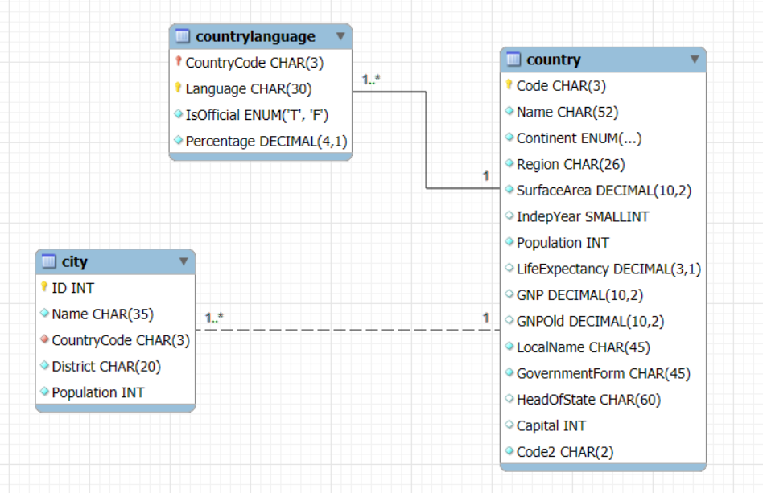
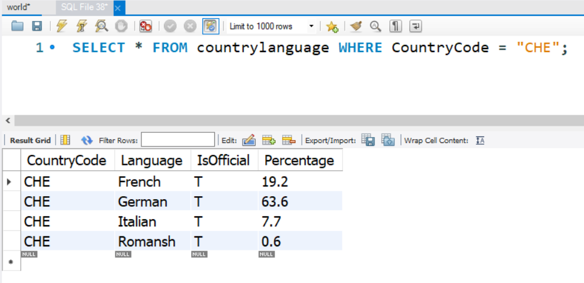
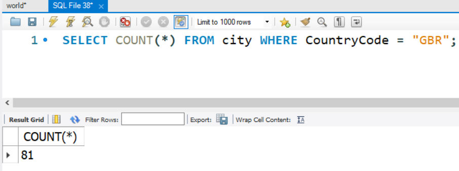

# Lab 2 - SQL Practice

This lab aims to give you practice in connecting to a sample SQL database and running some basic SQL queries upon it

## What you need to do

This practical work requires you to use MySQL Workbench to access your own MySQL database
(which is hosted by AWS). You can access MySQL Workbench as follows:
- Through the Windows desktop on a QMB Lab PC (type “SQL” into the search bar)
- Through the Windows desktop on a University PC via AppsAnywhere
- By downloading and installing it on your own PC from [this link](dev.mysql.com/downloads/workbench).

Before we start using the database, we need to perform three steps:
1. Initialise your AWS account - you should have recently received an e-mail from AWS asking
you to set up an account - follow the instructions in this e-mail. If you don’t have an e-mail,
check your spam folder, and if it's not in there either, please let us know!
2. Set up a relational database server (RDS) on your AWS account by following the [AWS
Learner Lab Database Setup Instructions](lab-3-aws.md)
3. Set up the database on your RDS using MySQL WorkBench - by the end of Part 2 above, you
should have connected successfully to the database server. Now download the file
World.SQL from MyDundee. Click File \ Open SQL Script and select the
World.SQL that you downloaded. This is a database populated with all the world's countries, their cities,
and languages spoken.
4. Now run the script by clicking the lightning flash icon on the toolbar to populate your
database (it might take a bit of time - there are a **lot** of cities in the world!)

## Let's look at the SQL!
There are a few features to note:
- The SQL is a simple (but quite big) text file
- An SQL database can be backed up to an SQL text file if required (it is recommended that
you do this at the end of each session); running the SQL file then recreates the database
- The attributes in the `CREATE TABLE` statements have appropriate data types, and note the additional
integrity features that can be added e.g. `NOT NULL`, `PRIMARY KEY` and `FOREIGN KEY` declarations
- The `set autocommit = 0` and `COMMIT` that sandwich the `INSERT` statements mean that either **all** 
these statements are executed, or **none** of them are - this is the concept of transactions that we'll
cover in Week 4!

## Try some queries
The database design is shown in the above image - it's quite simple, consisting of only three tables, but
there are plenty of interesting queries we can run on it!

Click the leftmost icon in the toolbar (SQL+) to open a new query window (leave the previously
loaded query where it is, as you will need it again).

Let's start by finding out what languages are spoken in Switzerland. In this case, the country code for Switzerland
is "CHE", so we need to do something like this:

`SELECT * FROM countrylanguage WHERE CountryCode = "CHE";`

'countrylanguage' is the table, and 'CountryCode' is the attribute we use to search for a specific value. 

We can also do **aggregation** operations, like counting the number of particular records, or summing up different values.
For example, to find out how many cities there are in the UK, we can use the `COUNT` operator like this:

`SELECT COUNT(*) FROM city WHERE CountryCode = "GBR";`

Rather than returning all the information about each of the cities, this simply spits out a number telling us how many cities
have the country code "GBR" (in this case, it's 81, which is 5 more than what Wikipedia says it is, but that's another mystery for another day).

## Try it yourself
I've written a quiz in MyDundee that I'd like you to try and answer using this dataset and appropriate SQL queries. It doesn't count towards your grade;
it's just to practise your ability to work with SQL! The questions are as follows:

1. How many countries have a life expectancy of higher than 80?

2. Rounding to the nearest 1,000, what is the **average** population of Scottish cities?

3. Which country is the most recent in the Americas to achieve independence? (YOu might want to use the **LIKE** and **ORDER BY** operators here.)

4. How many countries have a capital city beginning with D? (Hint, you'll likely need a **JOIN** and the **LIKE** operator too).

5. Which region of the world has the largest cumulative population? (Hint, a **GROUP BY** would be useful here.)

6. Which country has the highest number of cities (and how many)?

7. Name one of any two of the countries with the most official languages (according to the dataset, anyway). You'll likely need a very similar query to the previous question.

8. What is the most populated city in a country with Arabic as an official language (this is a difficult one that requires all three tables and possibly a nested subquery!)