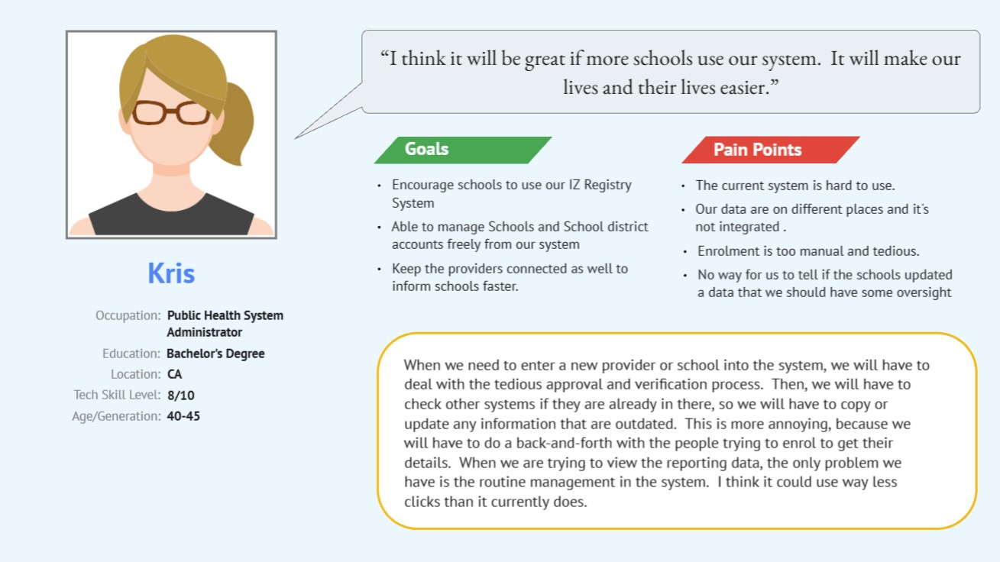

# Lab 4 - Defining the Problem
Good morning! 

In this lab I would like you to think about your time with the User Centre members on Friday and consider what broader themes you identified with the end goal of defining what the problem is from the perspectives of **personas**. What kind of users did you identify, what do they get out of the User Centre, and what are the challenges they face?

As mentioned last week, the purpose of a persona is to build **empathy** with potential users. By focusing on archetypes of typical user groups, rather than just the amorphous concept of "users", the intention is that personas will give your group a focus in deciding on important design decisions, rather than just a wish-list of features that **you** think are important.

Now that many of you have met with real people, you can move from assumption-based proto-personas to the real thing. While this initial contact was limited to a fairly short session, it should have been enough to correct any assumptions you may have made about how the User Centre works.

## What you need to do

1. Finalise any heuristic evaluation tasks that you need to do as a group. I hope you're all close to being done with this but there's still time if not!

2. Hopefully those of you who attended the User Centre on Friday took some form of notes, either during the session or shortly after, that you can refer to as guidance. At the time of writing, one group has added their notes from the session, so please add your own group's notes as soon as possible to allow everyone to maximise the quantity and diversity of user feedback.

3. Now, as we've discussed, personas are archetypes of users that represent typical goals, behaviours, and challenges. While many persona templates you can find online contain quite a lot of fluff, they essentially boil down to a name, ideally an image, a brief biography, goals, and challenges. This [Miro template that I referred to last week](https://miro.com/templates/user-personas-simplified/) is a good place to start. Take your initial understanding of the target users (e.g., helper volunteers, regular or drop-in members) and develop personas with this, or a similar, template.

You may worry that the information you have so far isn't in-depth enough to clearly and accurately represent the user base - that's okay! The important thing is that you have some initial ideas that you can develop and later validate with User Centre members to make sure you're on the right track.

## Developing User Stories

4. Your developed personas will have needs and goals, which can be represented as **requirements**. For those of you who have experience of Software Engineering, requirements are typically formulated as "The system should....". That is, the focus is on **what** the system should do, not **how** it should do it. This is a known part of the software engineering process, but the focus is on the technology, rather than the user of the technology. In this module, contrary to most Computer Science modules you'll have taken so far, you have to try and think of yourself **not** as a software developer, but as a **user experience designer**. In doing so, you need to consider:

- **Who** are the users?
- **What** do they need?
- **Why** do they need it?

The focus is not on system requirements, but on **user** requirements. You need to be able to think from the perspective of your intended users (which is why we do user research) rather than the perspective of a developer who may not know the users but has been asked to implement features X, Y, and Z.

In short, don't think about what features your 'solution' should have, but instead think about what typical users need to be able to do, and what barriers might prevent them from doing so, regardless of the application itself. This thought process is the essence of developing good user stories (i.e., requirements that are representative of your target users, what they need to be able to do, and why).

So, once you have your initial personas developed, go on to develop appropariate user stories for each of them. Don't worry too much about whether you've got everything exactly right! You'll refine them in time following ideation and validation with the User Centre members.

