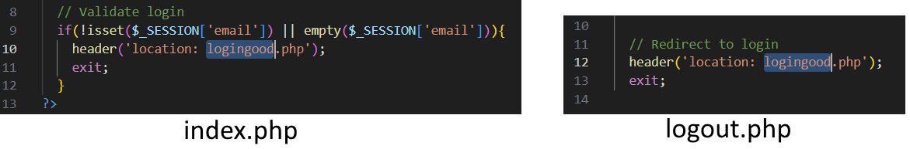

# Lab 3 - SQL Injection 

This lab aims to give you an understanding of **SQL Injection**, why it's a bad thing, how you can use it to access things you shouldn't (but don't) and what database developers can do about it!

## What you need to do

Step 3 - Creating a new schema

Step 5. Double-click to use new schema

This practical work will again require you to use MySQL Workbench to access your database. You don't have to go through all last week's steps again - so long as you have your database credentials, that's all you need!

Here are the steps you'll need to do to load my example database.
1. Connect to your database in MySQL Workbench like you did last week.
2. Download the file **compsci.sql** from MyDundee. This is a database I've made up that has everyone in the class and some fake grades for some modules (please don't take the grades personally - they've been randomly generated to be between 1 and 23!). It also has some staff details, including which of the modules they teach.
3. Create a new **schema** to hold this database by clicking the "Create New Schema" icon
4. Give your schema a name and click the 'Apply' button.
5. Double-click this new schema in the left pane to *use* this database schema.
6. Now, open the compsci.sql database script and run it by clicking the lightning bolt icon (again, like you did last week).

## Try some queries
With any luck, all should be well and the tables should be created! The database schema is shown in the image at the top. You can try running some queries on it directly from MySQL Workbench. For example, you can select your own grades with something like:

`SELECT * FROM Grades WHERE email = "2141414@dundee.ac.uk";` (Insert your own email address in here)

You can also find the staff member(s) that lead each module like so:

`SELECT Staff.firstname, Staff.lastname, Module.moduletitle FROM Staff JOIN Module ON Module.modulelead = Staff.employeeid`

But! We're going to access the databse through a (very) simple web app instead.

## The web app
I've modified a simple web app taken from an excellent example at https://github.com/bradtraversy/phploginapp. In this, we have the following files:

- **db.php** - This is the file where you provide your database credentials (see instructions for this below)
- **loginbad.php** - This is my BAD login page, vulnerable to SQL injection!
- **logingood.php** - This is a much better login page, using Prepared Statements to maximise security.
- **index.php** - This is the page you'll see when you've logged in, showing your grades for each module in a nice table.
- **logout.php** - This is the PHP script to log you out once you've logged in.

Download the "PHP Login App.zip" file and extract this to wherever you like. 

The first thing you need to do is edit the db.php file so that the app can connect to your database! All you'll need are the credentials that you used to connect to your AWS database last week (i.e., the host name, your username, your password) but ALSO the name you gave to your newly created schema! This goes in the **$database =** section.

Once you've done this, navigate to the folder in the command line, and launch this on localhost with the following command:

`php -S localhost:8000`

This will launch the PHP web app locally. Typing `localhost:8000` into your web browser of choice will then display something that looks like the image below (if it doesn't, something's gone wrong and please catch Ramon or me during the lab!).

The default login is the **loginbad.php** version, which is vulnerable to SQL injection. For example, take the following nefarious login attempt.

If we look at the PHP, we can see the query is constructed like this:

`$sql = "SELECT email, firstname, pword FROM Student WHERE email = '$email' AND pword = '$password'";`

See how the email and password variables are passed **directly** into the SQL? This means that, when you have a legitimate login attempt, the query will look like this:

`SELECT email, firstname, pword FROM Student WHERE email = '2131313@dundee.ac.uk' AND pword = 'thepassword'`

BUT, in my nasty example above, the query will look like this:

`SELECT email, firstname, pword FROM student where email = 'drough001@dundee.ac.uk' AND pword = 'idk'; DROP TABLE Grades -- -`

Try this out yourself and you'll find that it deletes the entire Grades table! Oh no! This happens because...

- The password I entered closes the single quotes before they're meant to be closed! By adding `idk';` to the query, this closes off the `pword = ''` part of the query and allows me to add something extra.
- The `DROP TABLE Grades` part is that which actually requests the Grades table to be deleted. I've chosen the Grades table because it can be removed without violating any foreign key constraints (any other table would not be deleted as easily as this)
- The `-- -` at the end is **super important**. `--` means "ignore everything after this". The following ` -` is just to demonstrate that there **must** be a space after the `--` for this to work! The additional hyphen highlights this.

If you run this query, no worries, just re-execute the **compsci.sql** script and it'll remake all the tables. 

## Trying some SQL Injection
Now that you know a bit about SQL Injection, try some of the following:

1. Login to any other student's account that isn't yours, using an incorrect password.

2. Update all your grades to be 23 (i.e., A1) - you can use the `UPDATE` SQL syntax here

3. Delete any other student from the database

4. Change the salary of your least favourite member of staff (but not me xx) to be 0 (you can check this has worked by running `SELECT * FROM Staff` in MySQL Workbench)

## SQL Injection Prevention

There are a couple of ways to prevent this happening, which are implemented in the file 'logingood.php'. Take a look at the file and see how it's different from 'loginbad.php'. In particular, it uses **prepared statements** like this:

This 'prepares' the SQL statement for the addition of parameters. Then, the 'bindParam' lines insert these parameters into the query, making sure that there's nothing dodgy. For example, if you inlude the single-quote mark ( ' ) then it won't execute! This is an excellent way to prevent SQL injection.

There are also a couple of other methods you can take. For example, the code below 'sanitises' the email address, by removing any characters that are invalid in an email address, and checking that the sanitized output is the same as the original email address.

To see this login screen in action, you need to change 'loginbad.php' to 'logingood.php' in index.php, as well as in 'logout.php'

Try the SQL injection attempts that you made in the previous step, and make sure that they don't execute properly. Prepared Statements and input sanitization are two important ways that SQL injection can be prevented.