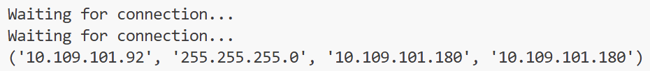
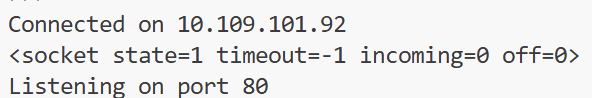
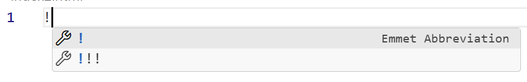
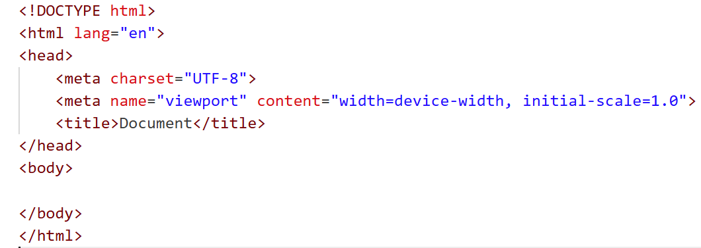
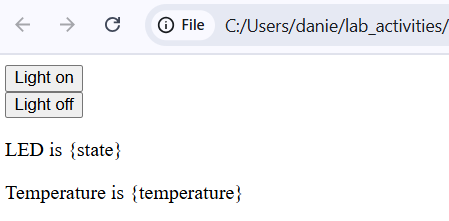
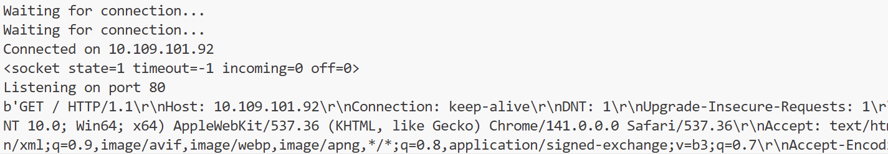
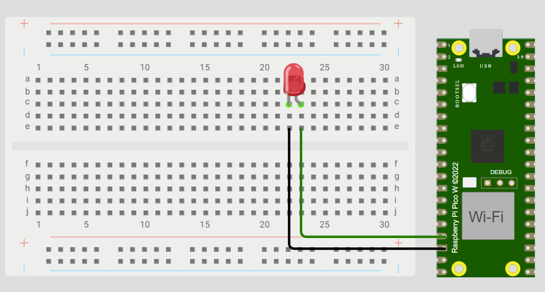

# CS12001 Lab 4 - WiFi with Raspberry Pi
Hello!

The aim of the lab is:
- To connect your Raspberry Pi Pico W to the Internet
- To get data to be sent and received from a simple web page

## Getting connected
In this lab, you’ll be turning your Raspberry Pi into a web server. It will connect to a WiFi network and you’ll be able to control it through a web page, as well as update that web page with data being read from the device itself.

First, make a new file and call it something like server.py. You’ll then need to import the following packages:

```python
import network
import socket
from time import sleep
from picozero import pico_temp_sensor, pico_led
import machine
import rp2
import sys
```

You’ll then need to specify the WiFi credentials. Now, this is a real pain to do with eduroam – the simplest way is to create a mobile hotspot and connect to that. Instructions for how to do this with an iPhone are [here](https://support.apple.com/en-gb/111785). Once you have this set up, the next step is to make variables in your code to store them (obviously storing your raw password in the code is generally a bad thing to do, but we'll cover that some other time).

```python
ssid = 'YOUR WIFI NETWORK'
password = 'YOUR PASSWORD'
```

The next step is to make a function (or method, or whatever you're told it's called in your Software Development module) that connects to a WiFi network. It looks like this:

```py
def connect():
    #Connect to WLAN
    wlan = network.WLAN(network.STA_IF)
    wlan.active(True)
    wlan.connect(ssid, password)
```

Couple of things to note here - the 'STA' in STA_IF refers to 'station', meaning a **client** that connects to an existing WiFi network.
'WLAN' stands for 'Wireless Local Area Network', which is exactly what a WiFi network is!

To this function, add the following code:

```py
def connect():
    ...
    while wlan.isconnected() == False:
        print('Waiting for connection...')
        sleep(1)
    print(wlan.ifconfig())
```

Then you can call it by writing ```connect()``` outside the function.

We do this because, as you know, WiFi connections are not immediate, and we need to wait inside this function until it finishes connecting. After it does, it'll print out some IP addresses that look a bit like this (your addresses will be different).



The **first** one is the IP address of the Raspberry Pi on your phone's network. The **third** one is the IP address of the 'gateway' (the phone's 'router' that communicates with the rest of the Internet).

We only really want the first one, though. Instead of ```print(wlan.ifconfig())```, replace that with the following:

```py
ip = wlan.ifconfig()[0]
print(f'Connected on {ip}')
return ip
```

The first line takes the first item (item 0) from the list of returned IP addresses. The second line does some pretty printing to show us which address we've connected to, and the final line returns the IP address that we'll need later. You should make sure to store this as a variable by replacing ```connect()``` with ```ip = connect()```.

Make sure this works before moving on!

## Opening a socket
Hurray, you've connected to WiFi! Now we need to open up a TCP/IP socket so that our Raspberry Pi 'server' can listen for connecting clients. As I hopefully mentioned earlier today, port 80 is the usual one for web server traffic, so that's what we'll use. Create a new function called 'open_socket' or something like that, and add the following code:

```py
def open_socket(ip):
    # Open a socket
    address = (ip, 80)
    connection = socket.socket()
    connection.setsockopt(socket.SOL_SOCKET, socket.SO_REUSEADDR, 1) #reuse address
    connection.bind(address)
    connection.listen(1)
    print('Listening on port 80')
    print(connection)
    return connection
```
You'll need the IP address returned from the previous ```connect()``` function, which you should pass into this function as a parameter.

The **listen** part is what makes this a server socket listening for clients, rather than a client itself. I've personally added the ```setsockopt()``` function in there because I found it was sometimes refusing to let me reconnect when re-running my code.

All being well, you should receive an output like this:



## Serving a webpage
So now your Raspberry Pi is acting like a web server, let's try and serve something - in this case, a webpage!

Make a new file and call it **index.html** (this is the name of the homepage on any website you visit).

an HTML file needs a fair bit of boilerplate code, but if you're working in VS code you can just type ! then Enter:



(Hopefully) it will generate it all for you!


If not, then I apologise for the disappointment. Now, inside the <body> tags, we're going to add two buttons that will, in time, allow us to turn an LED on or off. Add the following HTML:

```html
<form action="./lighton">
<input type="submit" value="Light on" />
</form>
<form action="./lightoff">
<input type="submit" value="Light off" />
</form>
<p>LED is {state}</p>
<p>Temperature is {temperature}</p>
```
Those last two lines are going to dynamically report whether an LED is on or not, and what the current temperature is. Right now, though, if you open up your HTML file in a browser, it should look like this:



It's not very pretty, but that doesn't matter - we only care about the functionality. We can 'serve' this HTML through a new function. Call it 'website' or something like that, and copy-paste your HTML code into it like this:

```py
def webpage(temperature, state):
    html = f"""
            <!DOCTYPE html>
            <html>
            <form action="./lighton">
            <input type="submit" value="Light on" />
            </form>
            <form action="./lightoff">
            <input type="submit" value="Light off" />
            </form>
            <form action="./close">
            <input type="submit" value="Stop server" />
            </form>
            <p>LED is {state}</p>
            <p>Temperature is {temperature}</p>
            </body>
            </html>
            """
```
So as you can see, we've got the whole HTML string in there. We're going to pass in the temperature and state to this function later.

## Final steps

Let's make a function to start off the web server. We'll start by making sure our LED state is set (on or off, in this case off) and our temperature is set to 0.

```py
def serve(connection):
    #Start a web server
    state = 'OFF'
    led.off()
    temperature = 0
```
Remember the 'connection' object we returned from the ```open_socket()``` function? That's the thing that we pass into this ```serve()``` function. It contains both the IP address of our Raspberry Pi, and the port number we want it to listen on.

Next add the following code that will wait until a client tries to connect:

```py
def serve(connection)
    ...
    while True:
        client = connection.accept()[0]
        request = client.recv(1024)
        request = str(request)
        print(request)
        client.close()
```

Finally, make sure you're getting the IP address, making the socket, and serving it with the three lines of code below, which should be outside of your three functions (your function names might be different if you decided mine weren't good enough for you)

```py
ip = connect()
connection = open_socket(ip)
serve(connection)
```

Okay! Now run your code and let it start listening for a client. You can act as the client by opening up a browser and entering the IP address you're connected to. **NOTE: Your computer must be connected to the same WiFi network - i.e, your phone hotspot.**

You won't get anything back yet, but you should get some garbled-looking stuff printed in the console that acknowledges a "GET" request was made (i.e., a request for information).



We need to add a couple of lines to send the client back our HTML. To your ```serve()``` function, just before the ```client.close()``` line, add the following code:

```py
    html = webpage(temperature, state)
    client.send(html)
```
This calls the function that returns the HTML, and then sends it to the client. Save your code, run it again, then reload the page and click the buttons. Do you see that you're getting GET /lighton? and GET/lightoff? messages? We can use these to control whether an LED is on or off (or other things, but we'll stick with the LED for now). Update your code so that the loop looks like this:

```py
while True:
        client = connection.accept()[0]
        request = client.recv(1024)
        request = str(request)
        try:
            request = request.split()[1]
        except IndexError:
            pass
        if request == '/lighton?':
            pico_led.on()
            state = 'ON'
        elif request =='/lightoff?':
            pico_led.off()
            state = 'OFF'
        html = webpage(temperature, state)
        client.send(html)
        client.close()
```
This checks which button was pressed, and turns the built-in LED on or off. Now, some of your built-in LEDs don't work for some reason, so try wiring your board like this with an external LED (the anode is connected to GPIO 13, the cathode is connected to ground).



Try changing your code so that it will turn your LED on and off (no copy-pasting here - work it out for yourself :D). Finally, let's include the current temperature. To do this, we can either use an external temperature sensor (more accurate) or the Raspberry Pi has a built-in temperature sensor too. To get a temperature in Celsius, this needs to be converted from a reading between 0-65535, to a voltage, to a temperature. Again, I won't tell you how to do this. Not because I'm fed up writing this thing, but because it's good for you to find things out for yourselves! [Have a look at this tutorial](https://www.halvorsen.blog/documents/technology/iot/pico/pico_temperature_sensor_builtin.php) to see how it's done. 

## Anything else?
Congratulations! You've used the networking capabilities of the Pico W to send and receive data through a WiFi connection! Here are a couple of things to try:

1. Swap out the LED for something else, and see if you can control it via website buttons (for example, you could add more buttons that represent tones for a buzzer to play, or angles for a servo motor to spin to).

2. Use one of our [analog temperature sensors](https://learn.adafruit.com/tmp36-temperature-sensor/using-a-temp-sensor) to get a more accurate reading.

3. If you're savvy with web development, try and make the page look more appealing with some CSS.