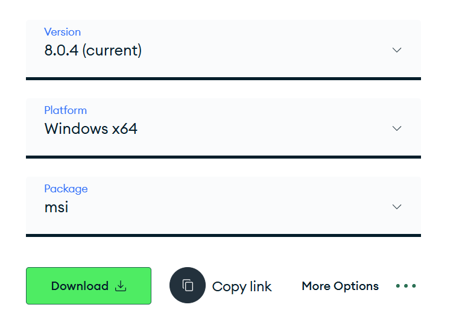
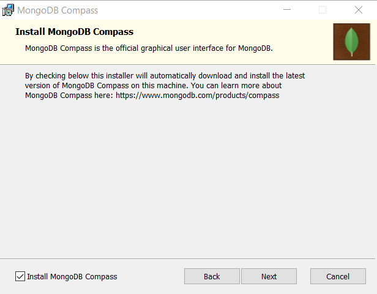

# Lab 4 - Installing MongoDB

Here is how you install MongoDB! The first set of instructions are for Windows, and the following set are for Mac.

## Step 1 - Installing MongoDB Community Edition
First you need to go to www.mongodb.com, and click on 'Community Edition'.

On the next page, click the 'Download Community' button.

Scroll down, select the current version (it should be 8.0.4), choose your version of Windows, make sure the Package is '.msi' (this makes things easier), and click 'Download'.

The setup wizard is fairly straightforward and you can leave most things as they are. When it asks you if you want 'Complete' or 'Custom', select 'Complete' to make sure that you have everything necessary for the rest of the lab.

On the 'Service Configuration' page, make sure 'Install MongoD as a Service' is checked. Leave the Service Name, Data Directory, and Log Directory as they are.

When asked if you want to install MongoDB Compass, make sure the box is checked. Compass is a nice GUI that you can usually make use of as an alternative to the command line.

All being well, you can finish the installation and MongoDB Compass will probably open automatically. Before you carry on, you should create a new connection through Compass. First, click on "Add new connection"

Then, leave everything as it is, and click "Save & Connect".

Then, in the 'Connections' sidebar, you should see a new connection **localhost:27017** with some pre-created databases, like in the image below.

The next step is to download the Mongo Shell for interacting with your MongoDB instance from the command line.

## Step 2 - Installing Mongo Shell
While MongoDB Compass is a very useful tool, it's good practice (and often more efficient) to work with MongoDB through the command line. 

1. First, go to [mongodb.com/try/download/shell](http://mongodb.com/try/download/shell) and download the .zip package for your operating system.

2. Once the download is finished, extract this .zip wherever you want, but I would recommend putting it in C:/Program Files/MongoDB, where the MongoDB server you installed in Step 1 should be located.

3. Wherever you choose to install it, next you should copy the address of the 'bin' folder, where the 'mongosh' executable is located.

4. Next, you'll need to add this to your system's path, so that you can run mongosh from the command line. Search for 'system environment' in the Start menu and click on 'Edit the system environment variables'.

5. Click on the 'Environment Variables...' button.

6. In the 'System variables' section, select 'Path' and click the 'Edit...' button.

7. Click on 'New', and paste the address of the bin folder that you copied before.

8. Click OK, and open any command line you want (I'm using Windows Powershell). Type 'mongosh', and all being well, it will run the executable and you'll have access to the Mongo Shell!

