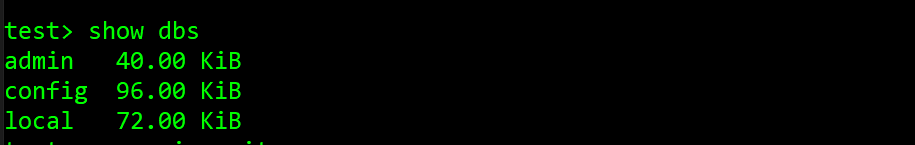
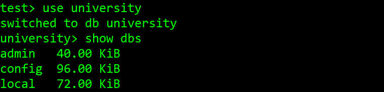
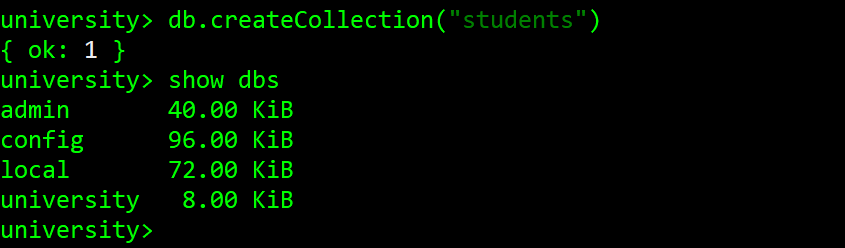
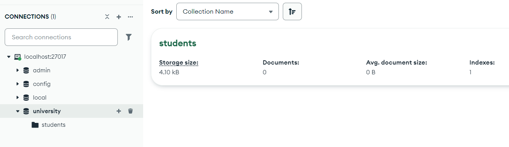
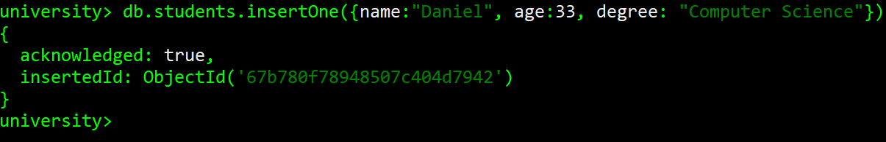
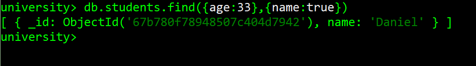
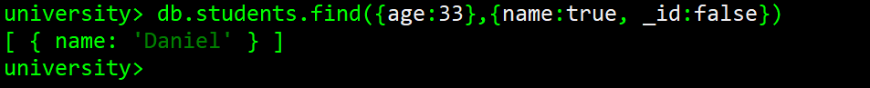
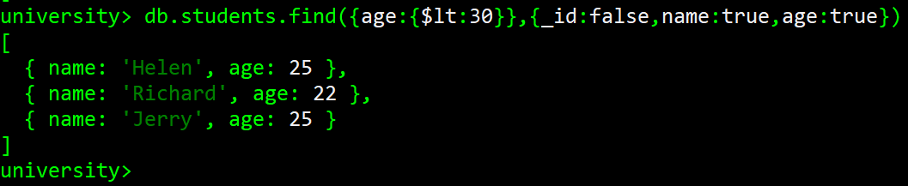
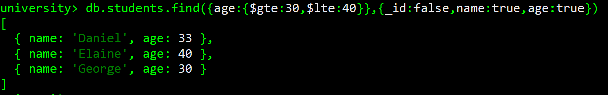
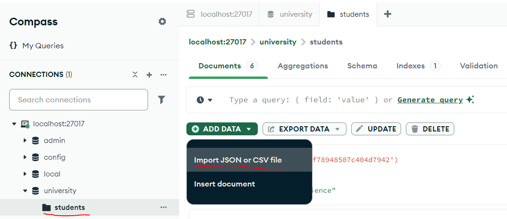

# Lab 4 - Getting started with MongoDB

This lab aims to give you an introduction to **document databases**, specifically MongoDB, one of the most popular
NoSQL database platforms out there.


## What you need to do
This practical work will require you to use MongoDB, which isn't installed on the lab machines, so you'll need to get this running on your own machine. I have made instructions for this [here](lab-5-installmongodb.md).

## Create a database
If you've followed the instructions above, you should have MongoDB and Mongo Shell installed on your machine. Open the Mongo Shell and type `show dbs`.



You'll likely see three default databases: 'admin', 'config' and 'local'. Don't worry about these as we're going to make our own. To do this, all we have to do is type `use (database name)`. In this case, I'm creating a database called 'university'. Follow along with this, and then type `show dbs` again.



As you'll see, the 'university' database isn't acknowledged. That's because it's empty, and we need to give it a **collection**. To do this, we use the command `db.createCollection()` and pass in the name of the collection we want to create. Here I've made a collection called 'students'. If we type `show dbs` again after this, we'll see the database now exists!



We can confirm this by looking in Compass. You should see that a database exists, with a collection called 'students' that doesn't have any data in it yet.



## Create a collection
Okay, let's add a **document** to the collection. Remember, a document is basically a piece of JSON (i.e., a set of key-value pairs), something like this:
```
{
    "name": "Daniel",
    "age": 33,
    "degree": "Computer Science"
}
```
Substitute your own name, age, and degree. Then, to add this into the **students** collection, we can use the `insertOne()` function, like so:



Note that the whole thing has to be surrounded by { curly brackets }. This can be a bit fiddly, but if we already have a lot of documents in a JSON format, then these can be entered in using the `insertMany()` function. Copy the JSON-formatted students below and insert it into your students collection using this function just like you used `insertOne()`.

```
[
{name: "Helen", age: 25, degree: "Computer Science"},
{name: "Richard", age: 22, degree: "Physics"},
{name:"Elaine", age: 40, degree: "Psychology"},
{name: "George", age: 30, degree: "Marine Biology"},
{name: "Jerry", age: 25, degree: "Psychology"}
]
```
Note that this whole thing is wrapped in [square] brackets, because it's basically an array of documents. Now that we have some documents in there, we can start running some simple queries.

## Some basic 'find' queries
The MongoDB equivalent to SQL's `SELECT` query is the `find()` function. So, the equivalent of `SELECT * FROM students` is `db.students.find()`. Try running this query and confirm that it returns a list of all the students in the collection.

### Filtering
Of course, we will typically want to give these queries additional filters so that we only return the documents we need. Rather than having a `WHERE` clause in the query, you specify the filters in the form of another document. For example, `db.students.find({name:'George'})` will return all students with the name 'George'. Try this and make sure that you can return your own details.

### Sorting
We can also sort returned values. Just like we had `ORDER BY` in SQL, there is a `sort()` function in MongoDB that we can use to order by a property in ascending or descending order. For example, `db.students.find().sort({age:-1})` will return all students from oldest to youngest. The -1 specifies **descending** order. Changing this to 1 will order by age in **ascending** order.

### Limiting
In SQL, we had the `LIMIT` clause to only return a certain number of records. This is basically the same in MongoDB, which has the `limit()` function. For example, to return the oldest student, you can do:
`db.students.find().sort({age:-1}).limit(1)`

### Changing the returned attributes
What if we wanted to **just** return names? In SQL, we just said what columns we were interested in, like `SELECT name FROM students`. With MongoDB, we do this by adding a **second** parameter to the `find()` function. As an example, if I only want to return the name of students aged 33, I could do something like this: `db.students.find({age:33},{name:true})`



Lovely. Except we still get that _id attribute returned every time. If you don't want that, you can add an extra part to this second parameter: `db.students.find({age:33},{name:true, _id:false})`



That's better. As something for you to solve, can you figure out how to get **just** the names of **all** students?

## Enter the operators
With SQL, we had operators like > and < (greater than or less than), as well as AND/OR/NOT Boolean operators. As you might expect, MongoDB has these too! As you also might expect, they're done a wee bit differently.

All operators in MongoDB are prefaced with a $ sign. Some of them have cryptic names, but you'll get the hang of it.

### Comparison operators
To return things that are **greater than** a value, we have the `$gt` operator. Similarly, we have the `$lt` operator for finding things that are **less than** another value. There are also `$gte` and `$lte` operators for greater than **or equal** and less than **or equal** respectively.

So, to return the name and age of everyone with an age of less than 30, we use the following query: `db.students.find({age:{$lt:30}},{_id:false,name:true,age:true})`. Try this and check that it works!



You'll be beginning to notice that MongoDB queries have a lot of curly brackets in them. Sometimes it can be easier to write them in an editor that auto-completes brackets (like VSCode) and then paste them into the shell.

We can also search for things **between** two other values. There's no special operator for this, we just need to combine the $gte and $lte operators, like this.

`db.students.find({age:{$gte:30,$lte:40}},{_id:false,name:true,age:true})`



### Logical operators
At this stage, let's start working with a larger dataset. Download the 'biggerstudents.json' file from the lab folder. This is a JSON file I've randomly generated with [mockaroo.com](http://mockaroo.com), which you might find useful for generating mock data for future projects. The easiest way to import this is with Compass. Click on your students collection, then 'Add Data', and then 'Import JSON or CSV file'. Choose the biggerstudents.json file you just downloaded, and it should hopefully add 100 extra students to the collection!



Now, the logical operators are more clearly named than the comparison operators. AND is $and, OR is $or. Some of the complexity comes from how you use them. Here's an AND query to find all students who are part-time, studying Marine Biology. 
`db.students.find({$and: [{fullTime:false},{degree:"Marine Biology"}] })`

Here, you have to specify an array of things you want to **and** together, with each in its own curly brackets. Try it out, and hopefully you get back 5 students like I did.

The OR is exactly the same. For example, we can find anyone who is 21 or called Sophia:
`db.students.find({$or: [{age: 21},{first_name:"Sophia"}] })`. Run this, and hopefully it will return you 4 students - two aged 21, two called Sophia.

Finally, an interesting additional operator is the **$nor** operator. This needs a list of things that all need to be **false** (kind of like the opposite of the $and operator). For example, let's find all the students who are neither older than 20, nor full-time.
`db.students.find({$nor: [{age:{$gt:20}}, {fullTime: true} ]})`

Again, this should return you 4 students, all of whom are 20 or younger, and part-time!

## Some questions for you
Based on all the stuff we've just covered, you should now be able to write queries to answer the following questions. I've added these into a quiz on MyDundee, which you can use to check your knowledge. Some of them will be trickier than others, but you can try as often as you like!

>For this quiz, I'd like you to use the 'evenbiggerstudents.json' file. First, delete the existing students in the collection by running the command `db.students.deleteMany({})`. Then, import the bigger list of students as you did before.

One more thing - if you don't want to return a full list of students, but just get the number of students satisfying a query, you can replace **find** with **countDocuments**, e.g., `db.students.countDocuments({age:20})`

1. What is the total number of Physics, Chemistry, and Medicine students?

2. What's the first name of the 50-year-old student who is studying English?

3. The first name of either of the two students with the highest grade average in Computer Science is ???

4. How many part time non-binary students (i.e., those with neither Male nor Female gender) are there?

5. The youngest male student with a grade average of between 2 and 5 is ???

6. The most popular degree subject is ??? with a total of ??? students.

**HINT**: You can figure this out by querying subjects one by one, but I'd suggest looking at the aggregate function of MongoDB that acts a lot like GROUP BY in SQL! [https://www.mongodb.com/docs/manual/aggregation/](https://www.mongodb.com/docs/manual/aggregation/)
