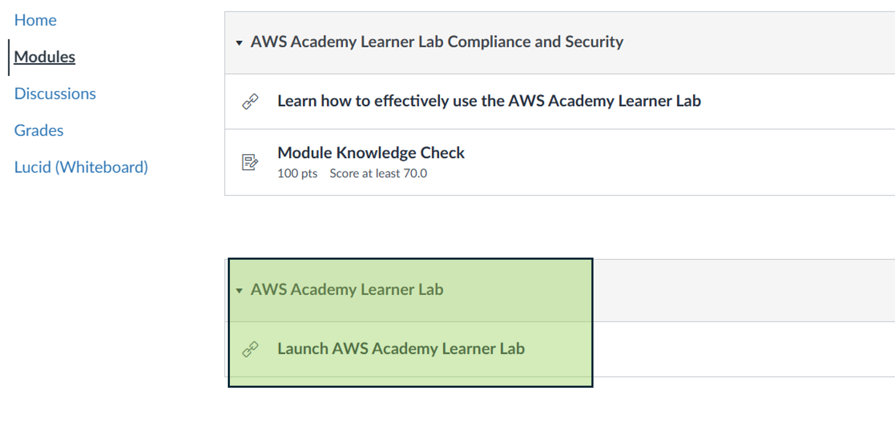
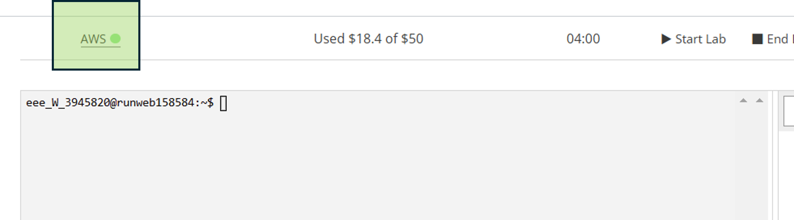

# CS12001 Lab 5 - Publishing/Subscribing with MQTT
Hi everyone!

The aim of the lab is:
- To register your Raspberry Pi as a "thing" in AWS (Amazon Web Services) MQTT broker
- To publish updates from the Raspberry Pi, and have it subscribe to updates from the broker


# Getting started with AWS
In this lab, you'll be registering your Raspberry Pi as a client on a cloud-based IoT system, managed by Amazon Web Services, which we have a partnership with in Computing.

You should have received an email from AWS Academy at about 10.30pm yesterday asking you to create an account. If you don't see this in your inbox, check your junk mail folder, and if it isn't there either, please let me know. If you **have** received this email, then great! Please follow the steps to create an account.


## Step 1 - Launch the AWS Learner Lab
<hr/>
First, click on "Modules" in the sidebar and then on "Launch AWS Learner Lab"
<hr/>


<hr/>

You should then see a new screen with the options below. Click on "Start Lab" as highlighted.
<hr/>


<hr/>

You'll need to wait a few seconds (sometimes a few minutes) but eventually the light on the AWS link will turn from red to green. Once this is done, click on the link.
<hr/>


<hr/>

This will then take you to the AWS Management Console. To find the IoT Core service that you need, open the search bar at the top, type "iot" and select the first option that appears.


<hr/>

## Step 2 - Add your Raspberry Pi as a "thing"

Now, the next few steps are a bit intimidating, and there may well be an easier way to do this through the AWS user interface, but this command line stuff definitely absolutely positively works so let's stick with it for now.

In the top bar, click on the >_ icon - this is the "CloudShell" and allows you to make stuff through a command-line interface.


Next, we need to enter a few commands to make sure we can maximise security through **keys** and **certificates**. You don't need to worry about what these are right now - just know that they're important to stop weirdos hacking into your smart home and burning your house down. 

First, install OpenSSL with the following command. 
```
sudo yum install -y openssl
```

SSL stands for "Secure Sockets Layer" and is basically there to secure communication over networks by stopping anyone else listening in.

Next, we're going to add a "thing" to our Internet of Things. In this case, it's your Raspberry Pi. Enter the following command, replacing "RaspberryPiPicoW" with whatever you like. The important thing is that you're making a variable called "THING_NAME" that we'll use right after this!

```
THING_NAME=RaspberryPiPicoW
```

The next step is to actually create the "thing" so that AWS IoT Core can recognise it. Enter the following command:

```
aws iot create-thing --thing-name $THING_NAME
```

This will create a thing in our Internet of Things with whatever name you gave it. The next bit looks awful, but what it does is create public/private keys and a certificate for our new thing. As I mentioned before, you don't need to know exactly what these are and how they work - just know that they make everything nice and secure when we're communicating between devices.

```
aws iot create-keys-and-certificate --set-as-active \
--public-key-outfile ${THING_NAME}-public.key \
--private-key-outfile ${THING_NAME}-private.key \
--certificate-pem-outfile ${THING_NAME}-certificate.pem > ${THING_NAME}_response
# Parse output for certificate ARN and ID
CERTIFICATE_ARN=$(jq -r ".certificateArn" ${THING_NAME}_response)
CERTIFICATE_ID=$(jq -r ".certificateId" ${THING_NAME}_response)
```

Alright, hopefully all is well so far. Next, we need to create a **policy** for our device. IoT policies are basically a set of rules to determine permissions for what our "thing" can access. Copypasta the following command into CloudShell:

```
POLICY_NAME=${THING_NAME}_Policy
aws iot create-policy --policy-name $POLICY_NAME --policy-document '{
   "Version": "2012-10-17",
   "Statement": [
       {
           "Effect": "Allow",
           "Action": "iot:*",
           "Resource": "*"
       }
   ]
}'
```

This is a nice and generous policy that basically allows the Raspberry Pi to do anything. In the real world this is probably not a good idea but it saves hassle.

NOW, **attach** that policy to the Raspberry Pi's certificate (that we made earlier on) like so:

```
aws iot attach-policy --policy-name $POLICY_NAME --target $CERTIFICATE_ARN
```

Okay now we need to attach the certificate to the Raspberry Pi (I know this is a lot but bear with me it will all come together). Run the following command:

```
aws iot attach-thing-principal --thing-name $THING_NAME --principal $CERTIFICATE_ARN
```

So now we've got our keys and certificates, they need to be converted into ".DER" files. This is just a way of encoding the key/certificate files so that MicroPython can read them okay. Run the following command(s) to convert the private key and the certificate into the right format:

```
openssl rsa -in ${THING_NAME}-private.key -out key.der -outform DER
openssl x509 -in ${THING_NAME}-certificate.pem -out cert.der -outform DER
```

Here we've taken the '.key' and '.pem' files and converted them into two files: **key.der** and **cert.der**. Now you'll need to download these files. Click on "Actions" in CloudShell and then "Download file"


First enter **key.der** and click "Download", then **cert.der** and click "Download" again so that you have both files available on your machine.


You'll also need your "AWS Endpoint" - this is basically the web address we send requests to so that we can get new data that's been *pushed* to the MQTT broker.

```
IOT_ENDPOINT=$(aws iot describe-endpoint --endpoint-type iot:Data-ATS --output text)
echo "AWS IoT EndPoint: $IOT_ENDPOINT"
```

## Step 3 - Install Thonny
[Thonny](https://thonny.org/) is a Python development environment that makes installing different packages easy. It's not as full-featured as VS Code but it does make life easier here. Follow the instructions to download Thonny onto your laptop.

Once it's installed, plug in your Raspberry Pi and make sure it's detected. Then, go to **Tools** -> **Manage Packages** and install the MQTT client. Search **umqtt.simple** and install the package.


Now you need to upload your key and certificate to the device. The Thonny IDE should look a bit like this


We're going to create a new folder in the Raspberry Pi called 'certs'

- Click the menu icon in the bottom-left pane (≡) and select New Directory.
- Enter the name certs

In the top-left pane (your computer's files) find the .der files you downloaded

- Select each .DER file individually.
- Right-click each .DER file and select Upload to /certs.

Next, we'll create a new file that's going to contain the code below. In the bottom-left pane, click the menu icon (≡), select **New File** and call it **main.py**.


Copy and paste the code below - this sets up your Raspberry Pi for publishing and subscribing to 'temperature' and 'light' topics, based on the Raspberry Pi's internal temperature sensor and built-in LED respectively.

```py
import time
import machine
import network
import ujson
from umqtt.simple import MQTTClient

###############################################################################
### START CODE MODIFICATION ###################################################
###############################################################################

# Wifi Name / SSID
SSID = b'<your wifi network name>'
# Wifi Password
PASS = b'<your wifi password>'

# AWS ThingName is used for the Client ID (Best Practice). Example: RaspberryPiPicoW
CLIENT_ID = b'RaspberryPiPicoW'
# AWS Endpoint (Refer to "Creating a Thing in AWS IoT Core" step 13)
AWS_ENDPOINT = b'<your IoT Endpoint value here>'

###############################################################################
### END CODE MODIFICATION #####################################################
###############################################################################

# AWS IoT Core publish topic
PUB_TOPIC = b'/' + CLIENT_ID + '/temperature'
# AWS IoT Core subscribe  topic
SUB_TOPIC = b'/' + CLIENT_ID + '/light'

# Reading Thing Private Key and Certificate into variables for later use
with open('/certs/key.der', 'rb') as f:
    DEV_KEY = f.read()
# Thing Certificate
with open('/certs/cert.der', 'rb') as f:
    DEV_CRT = f.read()

# Define light (Onboard Green LED) and set its default state to off
light = machine.Pin("LED", machine.Pin.OUT)
light.off()

# Wifi Connection Setup
def wifi_connect():
    print('Connecting to wifi...')
    wlan = network.WLAN(network.STA_IF)
    wlan.active(True)
    wlan.connect(SSID, PASS)
    while wlan.isconnected() == False:
        light.on()
        print('Waiting for connection...')
        time.sleep(0.5)
        light.off()
        time.sleep(0.5)
    print('Connection details: %s' % str(wlan.ifconfig()))

# Callback function for all subscriptions
def mqtt_subscribe_callback(topic, msg):
    print("Received topic: %s message: %s" % (topic, msg))
    if topic == SUB_TOPIC:
        mesg = ujson.loads(msg)
        if 'state' in mesg.keys():
            if mesg['state'] == 'on' or mesg['state'] == 'ON' or mesg['state'] == 'On':
                light.on()
                print('Light is ON')
            else:
                light.off()
                print('Light is OFF')

# Read current temperature from RP2040 embeded sensor
def get_rpi_temperature():
    sensor = machine.ADC(4)
    voltage = sensor.read_u16() * (3.3 / 65535)
    temperature = 27 - (voltage - 0.706) / 0.001721
    return temperature

# Connect to wifi
wifi_connect()

# Set AWS IoT Core connection details
mqtt = MQTTClient(
    client_id=CLIENT_ID,
    server=AWS_ENDPOINT,
    port=8883,
    keepalive=5000,
    ssl=True,
    ssl_params={'key':DEV_KEY, 'cert':DEV_CRT, 'server_side':False})

# Establish connection to AWS IoT Core
mqtt.connect()

# Set callback for subscriptions
mqtt.set_callback(mqtt_subscribe_callback)

# Subscribe to topic
mqtt.subscribe(SUB_TOPIC)

# Main loop - with 5 sec delay
while True:
    # Publisg the temperature
    message = b'{"temperature":%s, "temperature_unit":"Degrees Celsius"}' % get_rpi_temperature()
    print('Publishing topic %s message %s' % (PUB_TOPIC, message))
    # QoS Note: 0=Sent zero or more times, 1=Sent at least one, wait for PUBACK
    # See https://docs.aws.amazon.com/iot/latest/developerguide/mqtt.html
    mqtt.publish(topic=PUB_TOPIC, msg=message, qos=0)

    # Check subscriptions for message
    mqtt.check_msg()
    time.sleep(5)
```

## Step 4 - Modify code
There are a few things to modify here.

1. Just like last week, you should change the SSID and password for connecting to WiFi to your mobile hotspot.

2. Now, where it says ```CLIENT_ID = b’RaspberryPiPicoW’```, you should change 'RaspberryPiPicoW' to whatever you named your "thing" earlier on.

3. Finally, where it says ```AWS_ENDPOINT = b’<your IoT Endpoint value here>‘.``` you should paste in the endpoint that you found earlier.

Now, run the file, and hopefully you should see it's now publishing its temperature reading every five seconds to anything that subscribes (although we haven't subscribed to it yet).

## Step 5 - Check message flow between Raspberry Pi and AWS IoT Core
Back in AWS, make sure you're in IoT Core, and click on **MQTT test client** in the left panel.

1. Click on 'Subscribe to a topic'

2. In the box, enter "/" + your thing name + "/temperature" (this is the name of the temperature topic for your device) and click **Subscribe**.


If this works, you should see the temperature readings coming from your Raspberry Pi. 

3. We can also 'publish' to the light topic. In the code above, we subscribed the device to the light topic so that it will listen for any updates, and change the built-in LED accordingly.

- Click on "Publish to topic", enter "/" + your thing name + "/light".

- In the box, enter ``` { "state": "on" }``` and click **Publish** which should turn the built-in LED on, or ``` { "state": "off" }``` which should turn it off again (if your built-in LED isn't working, try modifying the code so that it turns on an external LED instead).

## Anything else?
If you've got this far, you've used MQTT to get your Raspberry Pi publishing and subscribing to AWS IoT Core. Next week, we'll have a look at getting two Raspberry Pis to communicate with one another, but for now, try modifying the sample code so that it publishes readings from another sensor (e.g., an external temperature sensor, a light sensor, a pressure sensor, etc), and subscribes to something else (for example, change the colour of an RGB LED based on a message from the IoT client).

