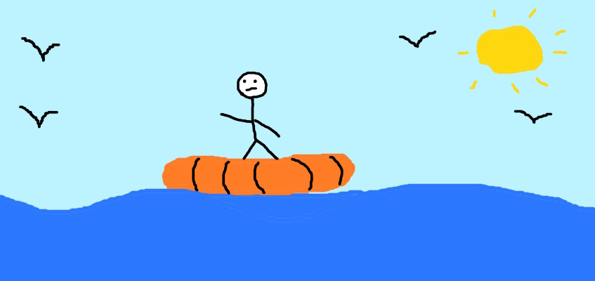
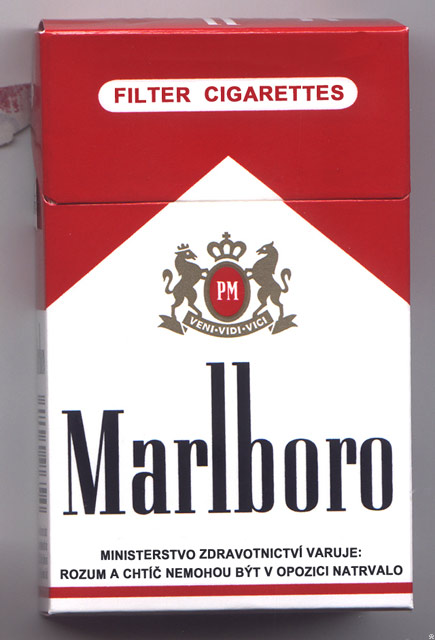
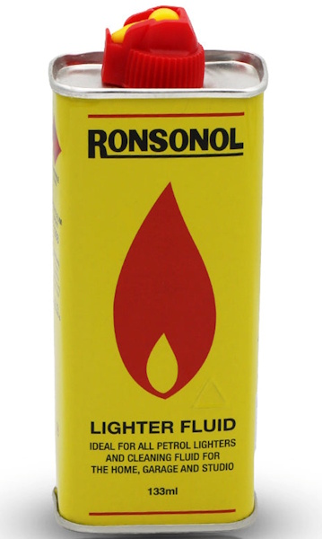
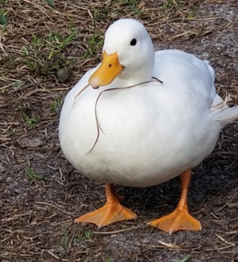
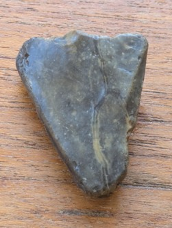
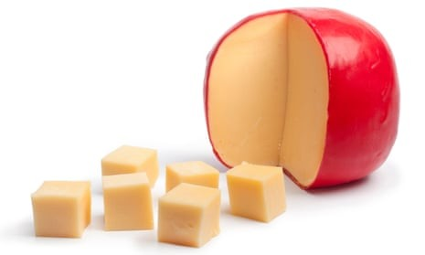

# There is no lab this week

I told you that already. But since you've decided to click on this anyway, here's a puzzle if you're feeling clever.

You are in an inflatable lifeboat, somewhere in the sea far from land. In your possession you have:

<ol>
<li style="display: flex; align-items: center;">A pack of cigarettes
    
</li>
<li style="display: flex; align-items: center;">A bottle of lighter fluid
    
    </li>
<li style="display: flex; align-items: center;">Terry, your emotional support duck
    
    </li>
<li style="display: flex; align-items: center;">A stout piece of flint
    
    </li>
<li style="display: flex; align-items: center;">Six cubes of edam cheese
    
    </li>
</ol>

## How do you light your cigarette?
