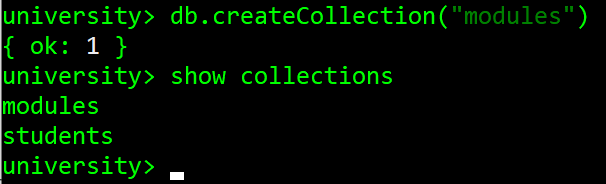
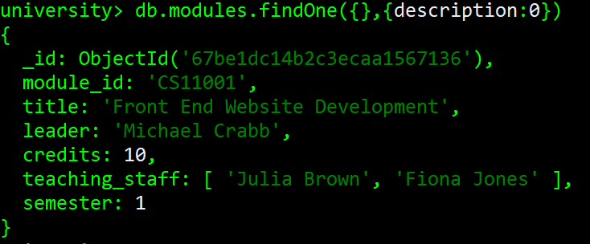

# Lab 5 - Some more MongoDB

This lab aims to give you a bit more practical experience working with MongoDB, including additional operations such as updates, deletes, and reads between collections. We'll also look in a bit more detail at the aggregation pipeline I talked about on Wednesday.


## What you need to do
Make sure you've installed MongoDB on your machine using [the instructions from last week's lab](lab-5-installmongodb.md).

Run the Mongo shell in your command line, and open MongoDB Compass. To see the details about your databases, you'll need to reopen the connection you made last week by clicking the 'CONNECT' button in the Collections sidebar.


You should also download the 'studentsmodules.json' file, which we'll be working with. To remove the existing students in your collection, run the command `db.students.deleteMany({})`. Then, import studentsmodules.json through Compass like you did last week. 

There is also a 'modules.json' file, which we'll import into a second collection. First, use the `db.createCollection("modules")` command in mongosh, and then check it has been added with `show collections`



The module titles and names are for Computer Science and Mathematics modules at the University of Dundee. The rest of the information has been randomly generated (because it was taking me way too long).

## Updating records
So far, we've covered Create and Read of the CRUD operations (and a bit of Delete), but what we need to do now is look at **updating** documents in our collections. We can do this using the `updateOne()` and `updateMany()` functions. 

First, we can get rid of at least one of the randomly generated names. Let's change the leader of CS11001 to be Michael Crabb. We can do this with the following operation: `db.modules.updateOne({module_id:"CS11001"}, {$set: {module_lead: "Michael Crabb"}})`


Then, to check that all is well, let's do `db.modules.findOne({module_id:"CS11001"},{description:0})` so that we don't get the lengthy lorem ipsum description.


Oh, oops. I forgot the module leader key was **leader** and not **module_lead**! This was my genuine mistake, but it's a good opportunity to show you how to **remove** fields, and also do two different updates at the same time! `$set` is used to give keys new values, while `$unset` is used to remove a key altogether!

In one operation, let's do: 
```js
db.modules.updateOne({module_id:"CS11001"}, {$set: {leader: "Michael Crabb"}, $unset: {module_lead:""}})`
```


OK let's check it's worked.


Hurray! In one operation we've **set** the module leader to be Mike, and **removed** the unnecessary "module_lead" field.

Next, all these are Semester 1 modules. Let's add a "semester" field to each of our documents. We can do this as follows:
`db.modules.updateMany({},{$set: {semester: 1}})`. We don't have any selection criteria, denoted by the empty { }, and we're setting the semester of each document to be 1.


Okay, it's updated 30 documents, which is reassuring, because that's how many there are! Let's find one using `db.modules.findOne({})` and check it has a semester field.



Oh good. You can check the rest if you want, but if tells you that 30 were updated then all should be well! 

## Working with arrays
You might have noticed that both of the collections' documents now have an array field - the documents in 'modules' have a 'teaching_staff' array, and the documents in 'students' have a 'modules' array.


In addition to basic data types like Strings, numbers, and Booleans, MongoDB has support for lists of things, which are a big no-no in SQL databases but really useful here!

Let's work with some basic array operations. To find everyone that takes the CS41001 module, all we need to do is `db.students.find({modules:"CS41001"})` - it doesn't matter that there are other things in the modules array - it'll just return every student where CS41001 is in there somewhere. Give this a go and check that you get 6 student documents back.

You can also do more sophisticated matches using the `$all` and `$in` operators. The first, as you might expect, returns documents where **all** specified elements are present. Let's use the **modules** collection here, and find all modules taught by both Bob Miller and Isaac Miller. We do this as follows: 
```js
db.modules.find({teaching_staff: {$all: ["Bob Miller", "Isaac Miller"]}},{description:0})
``` 
Rather than directly specifying the staff member we're looking for, we have to use $all followed by the array 
of teaching staff to find.


Similarly, if we want to find the modules taught by **either** Bob Miller **or** Isaac Miller, we can use `$in` for that in the same way. Try this, and check that it returns three modules where either Bob Miller or Isaac Miller are listed as teaching staff.

## Back to aggregations
I gave a bit of info about the aggregation pipeline on Wednesday - basically it's a sequence of data manipulations that allows for some more complex query potential than with the 'find()' function. Let's have a look at this with our existing dataset.

### $match

`$match` works exactly like the WHERE clause in an SQL query - if you're doing an aggregation, this should usually be done as early as possible, because it gets rid of unnecessary documents and speeds up the remaining bits of the pipeline. For example, to get all students older than 18 but younger than 21, we can do `db.students.aggregate([{$match: {age: {$gt: 18, $lt:21}}}])`. Try this - it should return 6 student documents.

Now, at this stage we can do exactly the same thing with a `find()` function, and if matching/sorting is all we need to do, then we needn't bother with the aggregation pipeline! The power comes in the additional stages.

### $group
`$group` groups documents together by a field. You probably guessed that already. BUT, this is something that can't be done with a simple find()! Let's have an example. We can group by subject like this: `db.students.aggregate([{$group: {_id: "$degree"}}])`. We have to specify an '_id' key, and the value (the field we want to group on) must have a '$' at the start of it. This simple example will return all the degrees in our dataset.


Lovely, but not all that useful in itself. What we *really* want to do is some sort of accumulation. So, let's count all the students that are on each degree programme. To do that, we add an extra step to the group function, which determines what we want to do with this grouping. In this case, we'll do a `$sum` to count the number of students in each degree, which looks like this: 

```js
db.students.aggregate([{$group: {_id: "$degree", total: {$sum: 1}}}])
```


Great! That's a bit more informative. We can also get some more information with a bit of additional query stuff. Let's say we want to know the average age of students on our degrees. We can do this like so: 
```js
db.students.aggregate([{$group: {_id: "$degree", total: {$sum: 1}, average_age: {$avg: "$age"}}}])
```
We can add other fields using operators like `$min`, `$max`, and other excellent examples that you can find [in the MongoDB documentation](https://www.mongodb.com/docs/v4.4/reference/operator/aggregation/group/). But let's try this one and see what happens.


OK, that's...fine. It's a bit ugly though - ideally we'd like those numbers to be rounded, but we can't do that sort of thing in the '$group' stage (also I have no idea why Civil Engineering has decided to span multiple lines). This is where the `$project` stage can come in handy!

### $project
`$project` passes **only** the specified fields to the next stage of the aggregation pipeline (unless this is the final stage, in which case it will just display them). Let's take a simpl*ish* example, which we could also do using `$find`. We'll get all the part-time students taking Computer Science, but we only want their names. We can do that like this: 
```js
db.students.aggregate([{$match: {degree: "Computer Science", fullTime: false}},{$project: {"first_name": 1, "last_name": 1, "_id":0}}])
```
Give this a go! It should (by my count) return the first name and last name of 11 part-time Comp Sci students.


As a less simple example, we can use it to tidy up our ages. We'll add a '$project' stage onto our grouping and round the age using the `$ceil` operator (which stands for 'ceiling'). This looks like this:

```js
db.students.aggregate([{$group: {_id: "$degree", total: {$sum: 1}, average_age: {$avg: "$age"}}},{$project: {_id:1, roundedAge: {$ceil: "$average_age"}}}])`
```

Not very friendly, but I hope you can see what's going on! We keep the _id field (which is the degree) and make a **new** field called 'roundedAge' which is calculated by rounding up the 'average_age' field from the previous pipeline stage. 

As with everything, I'd **strongly** recommend reading through the documentation to see what else you can do with these different pipeline stages and trying them out for yourself (you might need some extra info to answer the questions that are coming up).

### $lookup
Now, one of the main benefits of NoSQL is that you minimise complex joins like in SQL...but sometimes you can't eliminate them entirely. This is where the `$lookup` operator comes in handy - we can join documents in different collections together that we wouldn't otherwise be able to do outside the aggregation pipeline.

Sometimes we need to do this because keeping **all** the information in one document becomes unwieldy or too big. In the case of this example I made, it probably wouldn't make sense to keep details on all students on a module in a **modules** document, and it would be equally bulky to keep all details of all modules a student takes in a **students** document. But what if we wanted to get some information from both? If we don't need to do this very often, then a `$lookup` is ideal! (If we *do* need to do this often, then we might need to think about restructuring our data).

We're going to use the 'aggregate' function once again, since `$lookup` is a part of the aggregation pipeline. We'll keep it a bit more simple to start by *only* having `$lookup` in our pipeline.
Inside of lookup, we're going to specify four fields. The `from` field specifies the collection from which we're pulling data (in this case, **modules**). The `localField` field is the ID from documents in the collection that we're going to pull data into (in this case, **students**). The `foreignField` field is the equivalent ID in our `from` collection. Finally, the `as` field is just the name we're going to give to the field in the result document. So, let's have a go at joining our **students** and **modules** collections. The result query looks like this (note that we're using an array (modules) as our local field, but we don't have to!):

```js
db.students.aggregate([{$lookup: {from: "modules", localField: "modules", foreignField: "module_id", as: "module_info"}}])`
```

If you run this, you get an awful lot of data back. Let's try and limit this with a 'match' before the lookup, so that we can more clearly see what's going on. Let's only look for students that are taking MA40001 (in this dataset, there's only one):

```js
db.students.aggregate([{$match: {modules:"MA40001"}},{$lookup: {from: "modules", localField: "modules", foreignField: "module_id", as: "module_info"}}])
```

You should hopefully be able to see that it's matching all the module IDs that the student is taking with the full module info from the 'modules' collection! This is quite a nice thing to be able to do, but again, this is likely to be a rare query, and any questions you have about your data should *ideally* be answerable from a single document.

### $unwind
I'm introducing a lot here, but I promise it'll be useful. The `$unwind` operator sort-of 'unwinds' documents with arrays in them, so that it creates a new document for every item in that array. As a simple example, let's try: `db.modules.aggregate([{$unwind: "$teaching_staff"}])`. You should hopefully see that for each module, there are now **two** documents, one for both the members of teaching staff. This on its own isn't all that useful, but now we can group by teaching staff to see, for example, which staff are teaching the most modules, with something like this:

```js
db.modules.aggregate([{$unwind: "$teaching_staff"},{$group: {_id: "$teaching_staff", total: {$sum: 1}}},{$sort: {total:-1}}])
```


## Some questions for you
Based on all the stuff we've just covered, you should now be able to piece things together to answer these two questions. They will both need a few steps in the aggregation pipeline, and I'd recommend not trying to do it all at once, but instead add stages incrementally and check that the output is looking okay.

>For this quiz, I'd like you to make a new database called `quiz` and create collections for each of the three datasets: **movies.json**, **inventory.json** and **orders.json**. The movies dataset is a standalone thing, whereas the inventory and orders datasets can be joined together.

There are only a couple of questions here, because they require just about everything we've covered!

1. The name of the most commonly sold car is the ??? with a total of ??? sales

  I'd suggest starting by grouping car IDs together in the 'orders' table and going from there.

3. The most popular genre of film released in 2000 or later is ??? with a total of ??? films.

>Hint: The first stage of your pipeline should be getting the year out of the date object. [Have a look at this operator's documentation](https://www.mongodb.com/docs/manual/reference/operator/aggregation/year/)
