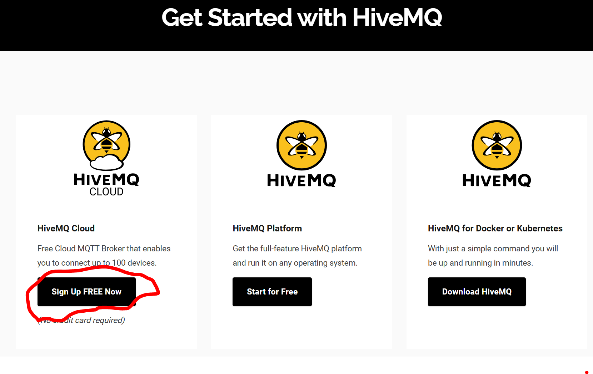
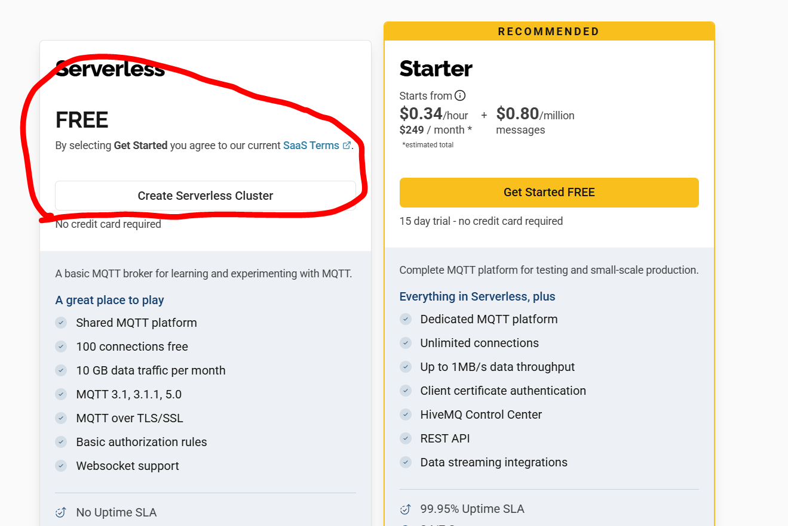
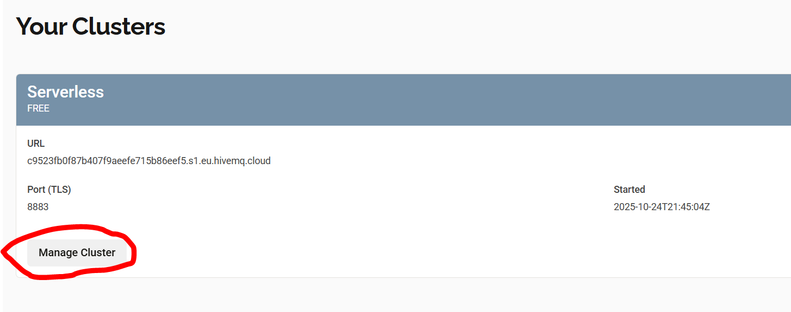
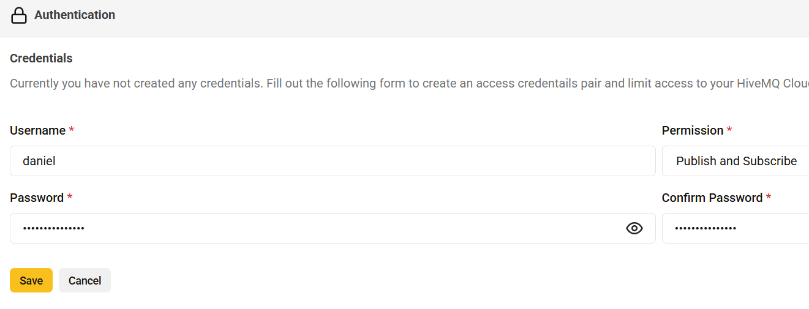
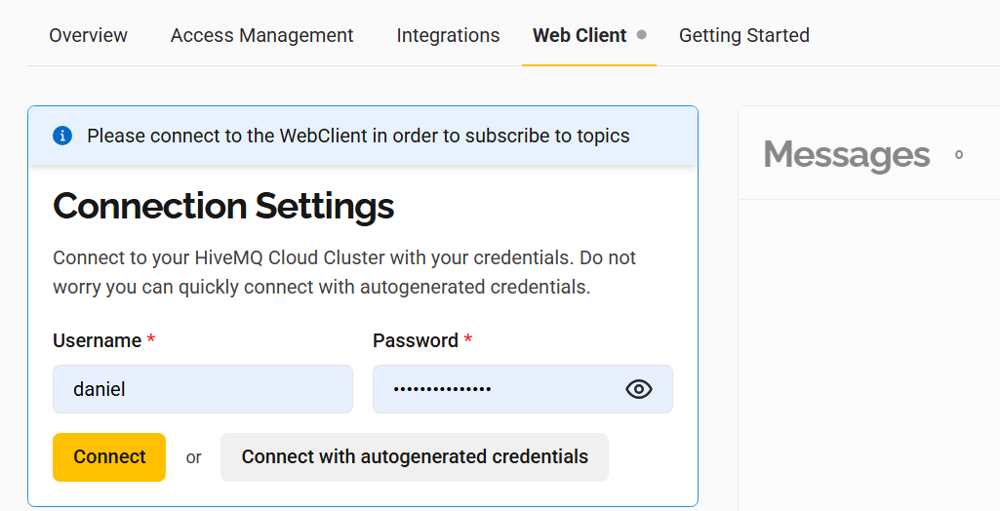
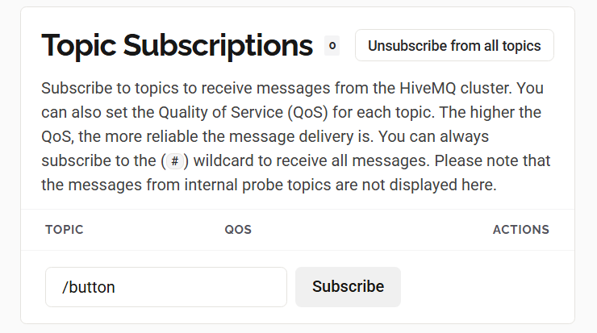
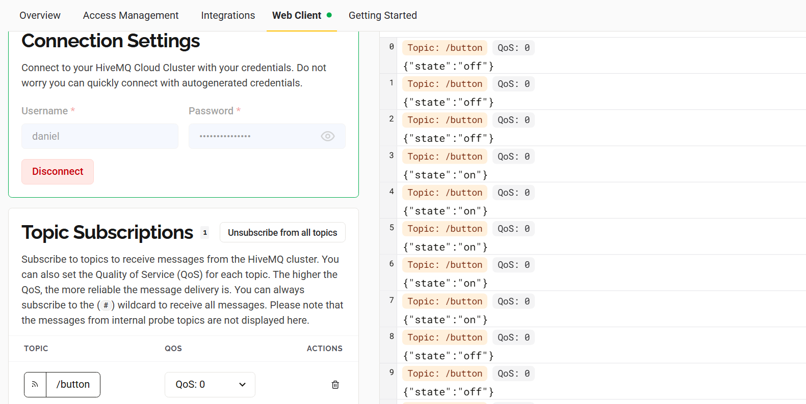
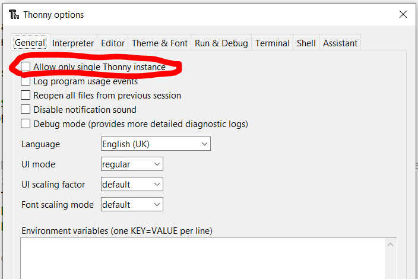

# CS12001 Lab 6 - Pi-to-Pi Communication
Good afternoon everyone! This lab is building upon last week's lab, but this time we'll be using a special free-to-use MQTT broker (Hive MQTT) to allow two Raspberry Pi devices to communicate.

The aim of the lab is:
- To create some code that connects to Hive MQTT and publishes some sensor data
- To create a separate piece of code that subscribes to this sensor data
- To see if you can get two devices working together so that one can be remotely controlled by the other.


# Getting started with Hive MQTT
In this lab, we'll be using Hive MQTT, which is a free MQTT Broker (unless you're dealing with loads of devices) that is a bit easier to work with than Amazon AWS, although arguably less secure.

First go to [the Hive MQTT website](https://www.hivemq.com/company/get-hivemq/) and click on the left-most option to sign up for free



Create yourself an account with your uni email address (or any email address really) and then you can get started in setting it up. When it asks you what service you want, make sure you click the free one (not the one it 'recommends')




## Step 1 - Managing your Cluster
Your cluster is just the name given to your virtual MQTT Broker. There are a couple of steps to getting it up and running. When you finish creating your account, you'll see there's already a cluster created for you. Click on "Manage Cluster" first.



Then in the 'Access Management' tab, click on 'Edit'. This is where you'll add your personal credentials


Click on 'Add Credentials' and then you'll be asked to enter a username (anything you like) a password (not necessarily the same as the one you used to create an account) and 'permissions' (set this to Publish/Subscribe).



## Step 2 - Install Thonny
Actually you should have done this last week. If you **didn't**, go back to last week's lab, read the instructions, install Thonny, add the umqtt.simple package, and come back. I'll still be here.

## Step 3 - Publishing to your MQTT broker
It's code time! In this case, we'll be making two separate applications - one that *publishes*, and one that *subscribes*. Later, once you're done, you can find someone else with a Pico to see if you can publish and subscribe to one another (or just grab an extra Pico if there's one laying around and you're not into talking to other people). I found a box in my house that I forgot about with like 8 more which I've put in the room with the others.

Anyway, here is some code to publish to a topic, that we'll be subscribing to soon. Copypaste this into a file and call it 'publish.py' or something like that.

```py
# module imports
import machine
import network
import ssl
import time
import ubinascii
import ujson

from umqtt.simple import MQTTClient

#MODIFY THIS STUFF HERE
SSID = "YOUR_NETWORK_ID"
WIFI_PASSWORD = "YOUR_WIFI_PASSWORD"

CLIENT_ID = b'ANYTHING_YOU_LIKE'
HIVE_URL = b'c9523fb0f87b407f9aeefe715b86eef5.s1.eu.hivemq.cloud'
USERNAME = b'your_credential_username'
PASSWORD = b'your_credential_password'

#The topic we're publishing to (in this case, a button press)
PUB_TOPIC = b'/button'

# Register Pin 8 to check for a connection completed by the button
# Remember, the PULL_DOWN is important!
button = machine.Pin(8, machine.Pin.IN, machine.Pin.PULL_DOWN)

# Wifi Connection Setup as usual
def wifi_connect():
    print('Connecting to wifi...')
    wlan = network.WLAN(network.STA_IF)
    wlan.active(True)
    wlan.connect(SSID, WIFI_PASSWORD)
    while wlan.isconnected() == False:
        print('Waiting for connection...')
        time.sleep(0.5)
    print('Connection details: %s' % str(wlan.ifconfig()))

#This returns 'on' if our button is pressed, and 'off' if it isn't.
def get_button_state():
    if button.value():
        return "on"
    else:
        return "off"

# Connect to wifi
wifi_connect()

# Set HiveMQTT connection details
mqtt = MQTTClient(
    client_id=CLIENT_ID,
    server=HIVE_URL,
    port=8883,
    user=USERNAME,
    password=PASSWORD,
    keepalive=5000,
    ssl=True,
    ssl_params={'server_hostname':HIVE_URL})

# Establish connection to HiveMQTT
mqtt.connect()

while True:
    # Publish the button's state
    message = b'{"state":"%s"}' % get_button_state()
    print('Publishing topic %s message %s' % (PUB_TOPIC, message))
    mqtt.publish(topic=PUB_TOPIC, msg=message)
    time.sleep(1)
```

There are four things you need to modify in addition to your Network SSID and password:

```CLIENT_ID```: This can be anything you like, but I've found that if it includes a number then that screws it up, so maybe don't do that and just make it your name or something (unless your name has a number in it but it probably doesn't)

```HIVE_URL```: This is the URL that is displayed in the "Overview" tab of your cluster.


```USERNAME``` and ```PASSWORD```: These are the username and password you created when you added a new credential before. Putting these directly in the source file is bad security practice but don't worry about it for now.

To make sure this is working properly, go to the "Web Client" tab, enter your username and password, and click 'Connect'.



You'll then need to subscribe to the '/button' topic. In the Topic Subscription pane, enter "/button" and then click "Subscribe".



Nothing should happen (unless you ran your code already in which case STOP JUMPING AHEAD and follow the instructions)

Okay, **now** run your code and hopefully you'll see messages in the Web Client (and in your Thonny console) that look a bit like this!



The next step is to get an **actual** client (i.e., another Pico W) to receive the messages and do something with them.

## Step 4 - Subscribing to your MQTT broker
This next piece of code looks very similar, but rather than publishing messages to the '/button' topic, it's **subscribing** to them. The idea here is that when the subscriber receives a message that the publisher's button is pressed, it'll turn on the subscriber's LED. It's Pi-to-Pi through WiFi! Here is the subscriber code, with the same stuff to fill in.

```py
# module imports
import machine
import network
import ssl
import time
import ubinascii
import ujson
from umqtt.simple import MQTTClient

#MODIFY THIS STUFF HERE
SSID = "YOUR_NETWORK_ID"
WIFI_PASSWORD = "YOUR_WIFI_PASSWORD"

CLIENT_ID = b'ANYTHING_YOU_LIKE'
HIVE_URL = b'c9523fb0f87b407f9aeefe715b86eef5.s1.eu.hivemq.cloud'
USERNAME = b'your_credential_username'
PASSWORD = b'your_credential_password'

#The topic we're subscribing to (in this case, a button press)
SUB_TOPIC = b'/button'

#For this you'll need to connect an LED to Pin 5 and a GND pin
light = machine.Pin(5, machine.Pin.OUT)
light.off()
 
# WiFi setup, same as before
def wifi_connect():
    print('Connecting to wifi...')
    wlan = network.WLAN(network.STA_IF)
    wlan.active(True)
    wlan.connect(SSID, WIFI_PASSWORD)
    while wlan.isconnected() == False:
        print('Waiting for connection...')
        time.sleep(0.5)
    print('Connection details: %s' % str(wlan.ifconfig()))

# Callback function for subscriptions - a bit different from last time
def mqtt_subscribe_callback(topic, msg):
    print("Received topic: %s message: %s" % (topic, msg))
   
    if topic == SUB_TOPIC:
        #Turn the message we received into JSON
        mesg = ujson.loads(msg)
        #Find the 'state' key in the message
        if 'state' in mesg.keys():
            #and check whether it's 'on' or ON' or 'On' or whatever
            if mesg['state'] == 'on' or mesg['state'] == 'ON' or mesg['state'] == 'On':
                #if so, turn our LED on
                light.on()
                print('Light is ON')
            else:
                #otherwise, turn it off
                light.off()
                print('Light is OFF')

# Connect to wiFi
wifi_connect()

# Set HiveMQTT connection details
mqtt = MQTTClient(
    client_id=CLIENT_ID,
    server=HIVE_URL,
    port=8883,
    user=USERNAME,
    password=PASSWORD,
    keepalive=5000,
    ssl=True,
    ssl_params={'server_hostname':HIVE_URL})

# Establish connection to HiveMQTT
mqtt.connect()

# Set callback for subscriptions
mqtt.set_callback(mqtt_subscribe_callback)

# Subscribe to topic
mqtt.subscribe(SUB_TOPIC)

# Main loop - with 5 sec delay
while True:
    mqtt.check_msg()
    time.sleep(1)
```
This code, like last week's code, has the 'callback' function that is used to subscribe for updates (our publisher code didn't have this). In this function, it receives a message like you saw in the Hive MQTT Web Client ({"state": "on"} or {"state":"off"}). We can extract information from this message to actually do something!

The code here relies on you having an LED connected with the long leg (anode) to Pin 5, and the short leg (cathode) to a Ground pin. If you connect your LED to a different pin, then you can modify the code to suit.

## Step 5 - Checking it works
Now, if you have two Pico Ws, you can test this by yourselves (but don't all go hogging two Pis or there won't be enough to go around). Thonny will get upset if you try to run more than one Pico at the same time. You can solve this by going to Tools -> Options and then unchecking the box that says "Allow only single Thonny instance". This will let you run the publisher Pico and the subscriber Pico at the same time.



But! I'd encourage you to try to connect to each other's Picos. One Pico runs the publisher code, another runs the subscriber code, and you'll need to make sure that your HiveMQTT URL is the same, and that one group adds credentials for the other group to publish and/or subscribe.

All being well, when the publisher Pico has the button pressed, the LED connected to the subscriber Pico will light up. If so, congratulations! You have the basis for an MQTT IoT network.

## Anything else?
If you've got this far, why not try substituting the 'sensor' on the publisher and the 'actuator' on the subscriber with other things? For example, you could swap out the button for a light-dependent resistor (or one of our new [light sensors](https://thepihut.com/products/photo-transistor-light-sensor)) to make an automatic light, so that when it's dark the LED will come on. 

Alternatively, you could try using one of the [motion detection sensors](https://thepihut.com/products/breadboard-friendly-mini-pir-motion-sensor-with-3-pin-header) connected to the publisher, with a buzzer connected to the subscriber, as a remote burglar alarm.

## Anything anything else?
Yes! Get thinking about your first assignment. What ideas do you have? Come up with as many as possible! What sensors will you need for that idea? What actuators? What kind of network connectivity will you need? 