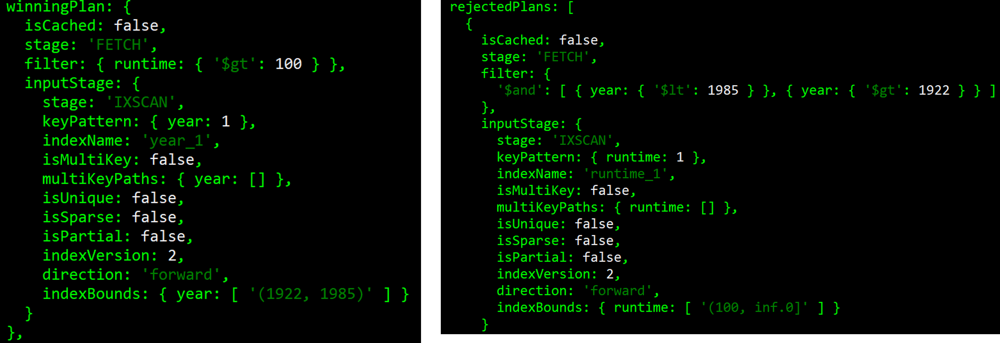
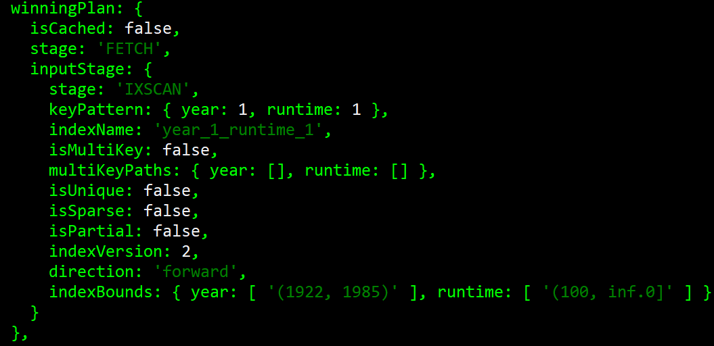

# Lab 6 - MongoDB indexes

This is a shorter lab to get you introduced to **indexes** in MongoDB for optimising query performance. We'll look at single-field indexes, compound indexes, and multi-key indexes. There will be fewer screenshots and examples of the code you need to write to give you a bit of practice in figuring out exactly what needs to be done.

## What you need to do
As with last week, run the Mongo shell in your command line, and open MongoDB Compass. To see the details about your databases, you'll need to reopen the connection you made last week by clicking the 'CONNECT' button in the Collections sidebar.

You should also download the `mflix.json` file, which we'll be working with. Make a new database called 'mflix', and create a collection inside of this called 'movies'. Then, import the mflix.json document into this collection. There should be a **lot** of documents (over 23000!), which will hopefully make the purpose of indexes more apparent!

You can inspect the document in Compass, or use `db.movies.findOne()` to pull a single document from the collection and inspect its attributes.

## Simple indexes
>Let's start with a simple query to find the movies released between 1922 and 1985 (these are arbitrary dates - no specific reason I chose them). You should be able to write this query yourself, but to get an idea of the stats, append `.explain("executionStats")` to the end of the query to see how it runs. 

There are a few things to note here. We've inspected the full set of documents, which isn't great. Your execution time may vary, but mine was almost half a second. When you consider that a collection might have millions of documents, you can see that this would scale up badly.

Another thing to notice is the `stage: 'COLLSCAN'`. This stands for **Collection Scan** and is the strategy used to return the results. What we'd like to do is optimise for queries associated with the release year (on the assumption that these are going to be run often). 

>Create an index on the year, sorted in ascending order (refer to this week's slides or to the MongoDB documentation on how to do this). Once you've done this, run the query again with the execution stats, and see what's changed.

Again, your mileage may vary, but now it's a **lot** faster. Notice that it has only inspected the documents that meet the criteria - the rest have been filtered out. A bit further down, and you'll come across the 'inputStage' details:

Notice the `stage: 'IXSCAN'` bit? This stands for **Index Scan** and is the strategy that MongoDB has decided to use to most efficiently return the results. You can also see the name of the index that's been used (year_1 in this case).

### Adding more indexes
You can of course have more than one index on a collection. 

>Let's also create one for the runtime of the movies, this time in *descending* order (and again, you'll have to figure this one out for yourself!). To check that it's worked, run the command `db.movies.getIndexes()`:

You should see the above three indexes - the two that you've created, and a default index on the _id field that is always present.

>Let's try running a query that uses both the year and the runtime. I want you to write a query that finds movies **between 1922 and 1985**, with a runtime of **more than 100 minutes**.

We won't worry about the execution stats right now. What we can do instead is run `db.movies.explain().find(*your query goes here*)`. This will return a shorter explanation of the query details. What I want you to notice this time is that we have a `winningPlan` field and a `rejectedPlans` field. Mine look like this:

On the left, the winning plan is that which MongoDB has decided will be the most efficient. Each stage passes its results up to the parent stage, so in this case, MongoDB has first retrieved the movies between 1922 and 1985, and **then** filtered them based on runtime. The rejected plan does it the other way around. What MongoDB decides will be the most efficient way of doing things depends on the number of documents expected to be returned at each stage. 

>This time, try updating your query to find movies in the same date range, but with a runtime of more than **200** minutes.

This time my winning plan and rejected plans are switched (presumably because the runtime stage will return fewer movies, which can then be filtered on their release year).

However, let's say we run this sort of query a lot (where we're interested in runtime and year). In such a case, it'd be useful to have a **compound index**. We'll cover that later, but first I want us to look at **multi-key indexes**.

## Multi-key indexes
Multi-key indexes and compound indexes sound like they do the same thing...but they don't! Multi-key indexes are used for when we want to index on items in an array. Since quite a lot of fields in our documents will be arrays, this is where multi-key indexes shine.

In our mflix dataset, each movie has an array of genres (e.g., [Biography, Drama, History]). Internally, MongoDB will decompose an array and store each of the unique values as a separate index entry.

>First, run a query to get all the movies that have the **Biography** genre, and use `.explain("executionStats")` to see what it's done.

You can see that the 'winning plan' was a simple COLLSCAN, and that it took about 350ms.

>We can fix that by creating an index on the `genres` field (this is done in the same way as creating any other index). Do that, and run the query again.

Much better! You should also hopefully see that the new execution strategy used an IXSCAN, showing that MongoDB correctly used the index.

### Querying on embedded fields
If we have something we want to index that's not a direct value or an array (i.e., it's in a subdocument) we can do that too. Consider the 'awards' field of our movie documents. The value of this is a subdocument containing awards, nominations, and text. 

>Try this out: query to find all movies with more than 15 wins, then add a new index on the `wins` field of the `awards` object, then run the query again. How much speed-up do you get?

## Compound indexes
A compound index, as you might expect, is an index that makes use of multiple fields, as opposed to having two separate single-field indexes. Note that our multi-key indexes in the previous section were also single-field indexes (because we only indexed on the array). 

>Let's go back to our original example, where we were interested in both runtime and year. Create a compound index on these fields like so: `db.movies.createIndex({year:1,runtime:1})`. Run `db.movies.getIndexes()` and, if you've followed along so far, you'll have the following (note that I've indexed on award wins in descending order):

>Now run the original query you had to find movies released between 1922 and 1985, with a runtime of over 100 minutes, and get the execution stats.

You should hopefully see that the winning plan uses the new compound index, and the rejected plans are the other two options that we saw before.

### Order matters!
I want to show you that the order of the fields in your compound index matters - it's not arbitrary. 

>Let's remove the single-field year index, and the single-field runtime index, using `db.movies.dropIndex("year_1")` and `db.movies.dropIndex("runtime_1")`. Run the getIndexes() command again and check that they're no longer there.

>Now, I want you to make two separate queries, and use 'explain' to see how they've worked. First, write a query to find movies released earlier than 1950. Then, write a query to find movies with a runtime greater than 200 minutes. Check the winning plan for each - is that what you expected?

Compound indexes support queries that match on the **prefix** of the indexed fields, i.e., the first field in our list. In this case, it was year. So, our first query to find movies before 1950 can use the year_1_runtime_1 index, but the query to filter on runtime can't, because it doesn't involve the year field!

### Optimising a compound index
To optimise a compound index where we're querying on multiple fields, the best order of our fields is represented by ESR (Equality, Sort, Range). That is, the first field(s) in our compound index should be those that have **exact matches**. Then, any fields that we're sorting on should be included. Finally, any fields where we're looking for a range (e.g., finding the movies between 1922 and 1985) should be last.

Let's say we frequently run a query where we get all the movies of a specific genre, between a certain year boundary, sorted by runtime. There are six possible order combinations of these three fields, but let's just create two. 

>First, create an index with `year` first, followed by `runtime`, followed by `genres`. Then, create a second index with `genres` first, followed by `runtime`, followed by `year`. This second one is in ESR order.

>Now, write a query to find all the History movies, released between 1940 and 1980, sorted by runtime. Look at the execution stats. You should see that the winning plan uses our nicely ordered index, and rejects both the other new index in year-runtime-genres order, as well as the year_1_runtime_1 index. 

Finally, it's worth noting that both these newly created indexes are both **compound** indexes AND **multikey** indexes, because they include an array field (genres). MongoDB will not let you have a compound index that includes more than one array field, so bear this in mind when thinking about writing indexes for your assignment!

## Quiz
There's a short multiple-choice quiz On My Dundee to test your understanding of indexes based on the content of this lab. No need for running any queries (since we haven't introduced any new query syntax this week!) so it should hopefully be quite straightforward.