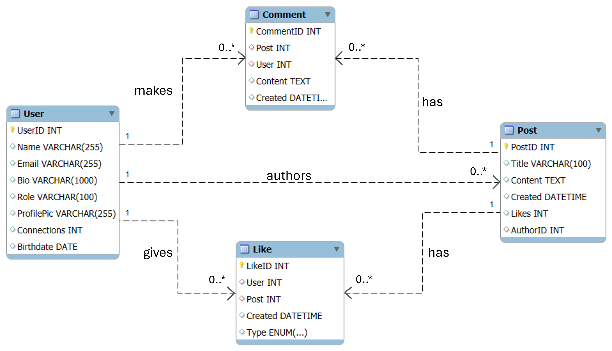
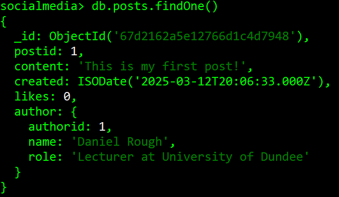
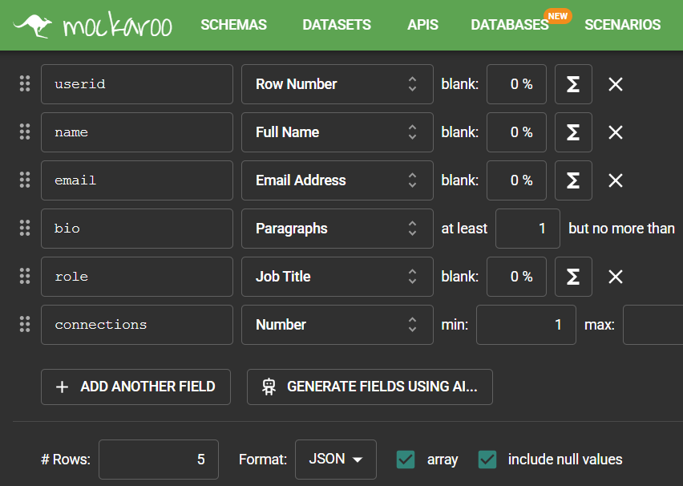
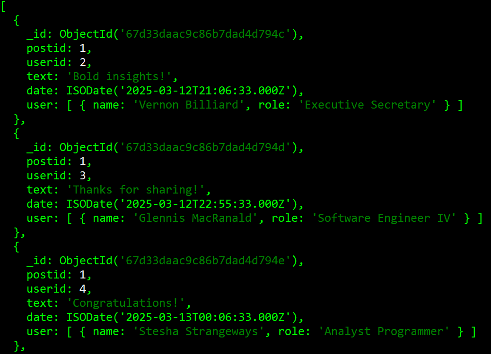
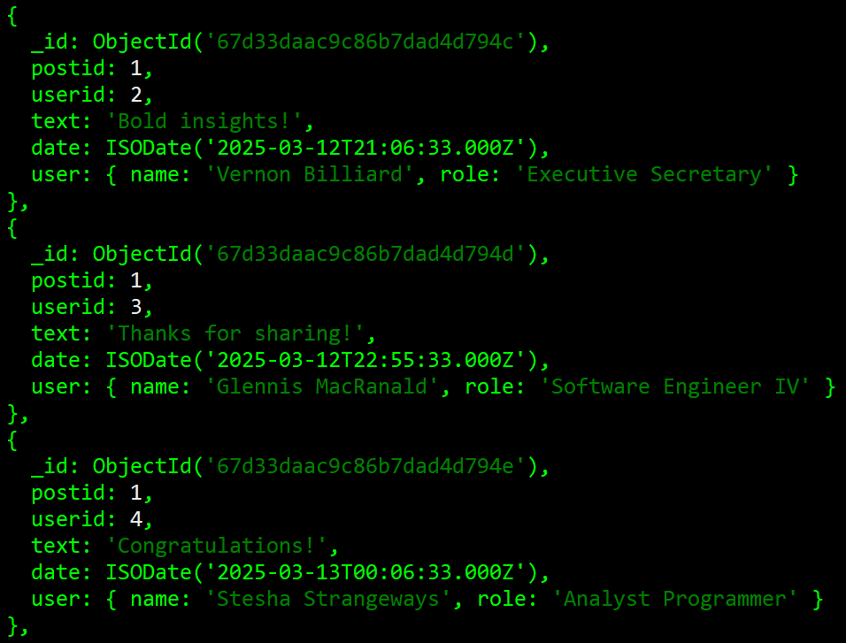

# Lab 7 - Data Modelling

In this week's lecture, we talked about data modelling, including whether its best to embed or reference, how to model one-to-one, one-to-many, one-to-VERY many, and many-to-many relationships. In this lab, we'll walk through the implementation In MongoDB of the social media app design that was covered at the end of the lecture. The ER diagram for this in MySQL would look something like this:



## What you need to do
Really the main thing you need to do is to try not to think in terms of a relational model. While we **will** likely need separate collections, and those collections **will** sometimes be joined together, there's a lot more room for manouevre, with denormalisation and duplication.

As with last week, run the Mongo shell in your command line, and open MongoDB Compass. Create a new database, call it 'socialmedia' or something like that, and create a new collection called 'posts' (you can do this in the command line or Compass, whichever you prefer).

This week there aren't any ready-made JSON files to download - we'll need to figure out the structure of our data from scratch. Let's start by inserting an example post, based on what we know. A post has **content**, it has a **date**, and it has a number of **likes** (it also has an author, but we'll come to that in a bit).

```js
db.posts.insertOne({postid: 1, content: "This is my first post!", created: new Date("2025-03-12T20:06:33"), likes:0 })
```

Hopefully all should be well and you should have a new document in your posts collection. Notice how I used the 'new Date(blahblah)' to create a date/time? You can also just use 'new Date()' to get the current date/time, or any other format you can find [here](https://www.mongodb.com/docs/manual/reference/method/Date/).

Notice I've also included a 'postid' field. Now, we can obviously use the built-in _id field (and adding an extra field adds a bit of overhead) but it'll make things clearer as we go through - the ObjectId("l2342jk34l2kh3234h") isn't exactly user-friendly!

Anyway, since this is a social media app, we're probably going to want to have a collection that contains user documents that contain all the information about a user. Create a new collection called **users** and make a new document to store yourself using the fields in my ER diagram, or change them up if you want (my fields are from LinkedIn).

```js
db.users.insertOne({userid: 1, name: "Daniel Rough", email: "drough001@dundee.ac.uk", bio: "blahbedy blahbedy bla bla rub-a-dub dub", role: "Lecturer at the University of Dundee", profilepic: "https://media.licdn.com/dms/image/v2/D4E03AQH_n3xP4eoesw/profile-displayphoto-shrink_400_400/B4EZOZekftHAAg-/0/1733446749200?e=1747267200&v=beta&t=94ChRS1CezVT2JpSEoG4nk1gL4g4ZaEJ9x3hgP5sDmI", connections:0, birthdate: new Date("1992-01-03")})
```

I've used a URL to link to a display picture, which is probably how it would be best done in the real world (as opposed to storing binary image data, which could get chunky).

## The Extended Reference Pattern
Now that we have a post and a user, it would be useful to link them together. We *could* store a list of a user's posts in their document, but then this would become an unbounded array, which we want to avoid, so let's add a new 'author' field to the post we just created.

```js
db.posts.update({postid: 1},{$set: {authorid: 1}})
```
Lovely - we now have a reference to the author in our post! We can get the name and role of the author (which is shown at the top of the post) by doing something like this:

```js
db.posts.aggregate([
{$match:{postid:1}},
{$lookup: {from: "users", localField: "authorid", foreignField: "userid", as: "author"}},
{$project: {"author.name": 1, "author.role": 1}}])
```
This **will** return the author's name and role, but it's a bit clunky, and if we had more than just one post and one user, it would take considerably more time! Instead, what we can do is **embed** this information in the `posts` document, on the assumption that the user's name and role are unlikely to change very often. I ran the query:

```js
db.posts.update({postid: 1},{$set: {authorid: 1, name: "Daniel Rough", role: "Lecturer at University of Dundee"}})
```

which screwed things up - I wanted this all as a single BSON object with 'author' as the key and the details as the values! If you ran this query before recognising my mistake, you can **unset** the fields added like so:

```js
db.posts.update({postid: 1}, {$unset: {authorid:"",name:"",role:""}})
```

Right, let's try that again. We'll run the following query...

```js
db.posts.update({postid: 1},{$set: {author: {authorid: 1, name: "Daniel Rough", role: "Lecturer at University of Dundee"}}})
```

...and now, we should find that all is well:


Brilliant, now we can directly find the author's name and role inside the post document, and if we need any further information, we can still use a reference based on the author's ID. This is known as the **Extended Reference Pattern**, and is especially useful when we still want things to be in a separate collection, but want to minimise the amount of joining required. 

## The Subset Pattern

In our example screenshots above, a post would show a couple of relevant comments, with the option to expand to see more. This makes sense - if you have a feed of posts and you're loading all the comments for every post on that feed, this could slow things down. In this case, the best thing to do is store the less important comments in their own collection. 

Let's add a few more users into our collection. This can be a bit tedious, so you can use some external tool for document generation. I used [Mockaroo](https://www.mockaroo.com) to generate five documents as shown in the screenshot below, but feel free to use generative AI or whatever.



Okay, now we can add a few comments to this post, which we'll put in the `comments` collection. I wrote these ones out below - feel free to copy them or make your own.

```js
db.comments.insertMany([
    {postid:1, userid: 2, text: "Bold insights!", date: new Date("2025-03-12T21:06:33")},
    {postid:1, userid: 3, text: "Thanks for sharing!", date: new Date("2025-03-12T22:55:33")},
    {postid: 1, userid: 4, text: "Congratulations!", date: new Date("2025-03-13T00:06:33")}, 
    {postid: 1, userid: 6, text: "La la la", date: new Date("2025-03-13T03:22:11")}, 
    {postid: 1, userid: 6, text: "Can't think of anything else", date: new Date("2025-03-13T18:27:00")}])
```


### Embedding fields from another collection
It'd be nice to also have embedded names and roles of the comment posters, since they should appear alongside the comment. This likely isn't the ideal way to do things, but here's a way we can use the aggregation pipeline to update each comment with the information about its poster (note, this is some hairy-looking stuff, but bear with me).

```js
db.comments.aggregate([
{$lookup: {from: 'users', 
    "let": { "id": "$userid" }, 
    "pipeline": [
            { "$match": { "$expr": { "$eq": ["$userid", "$$id"] }}},
            { "$project": { "name": 1, "role": 1, _id: 0 }}
        ],
    "as": "user"
    }
},
{$unwind: "$user"},
{$merge: {
    into: 'comments',
    whenMatched: 'replace',
    whenNotMatched: 'discard'
}}])
```

If you run this (**don't just yet!**), you'll get  a 'user' object inside each of the comments with the name and role of the poster of the comment! Note, in reality, we could implement whatever application we're using to insert this additional user info automatically - it's just that I forgot to do it in advance. 'That's all very well' you may say, but how does this work? Well, this is using the lookup pipeline - you can find the documentation for it [right here](https://www.mongodb.com/docs/manual/reference/operator/aggregation/lookup/), but let's break it down a bit. 

Rather than the 'localField' and 'foreignField' attributes that you've used in lookup queries before, this has a 'let' attribute, and a 'pipeline' attribute. ` "let": { "id": "$userid" }` simply means "the local field 'userid' (in the **comments** collection) will be referred to as 'id' in the following pipeline". It's giving an alias to our local field.

The pipeline is in itself a lot like the aggregation pipeline! It's used to add some more complex stuff to the results of our $lookup query. The first part, the $match, is used in the same way the `localField` and `foreignField` would be used in the normal lookup. The matching criteria is that the 'userid' in the collection we're looking up (users) is equal to that of the userid field in the comments collection (which, remember, we've called 'id'). Note that there are two dollar signs in front of id.

The next stage (this is an important one) is that we're using $project to **only** return the name and role of the user (because these are the only fields we want to put into the comment documents) and we give it the name `user`. Let's have a look at what this returns before we do anything else.



That's quite good, but we don't really want the user's information as an array. That's why we use `$unwind`. Let's run it with that additional stage.



That's better. But if you then query the posts, you'll see that the user information has not been added into the posts as we would like. That's where the `$merge` comes in. This takes the output from the previous stage from the foreign documents, and basically sticks it into the local documents. Okay, now run the full query and check that it works okay!

### Embedding the last few comments
Now, in line with the subsetting pattern, we'd like to keep a few comments embedded as duplicates directly within the post, while storing all of them in the `comments` collection. Below we have an aggregation pipeline that will match up all comments to each post in our posts collection, limit them to the three most recent, and then merge them into each post document. Again, this looks nasty, but we'll break it down.

```js
db.posts.aggregate([{
    '$lookup': {
      'from': 'comments',
      'let': {
        'id': '$postid'
      },
      'pipeline': [{
          '$match': { '$expr': { '$eq': ['$postid', '$$id'] } }
        }, {
          '$sort': {  'date': -1 }
        }, {
          '$limit': 3
        },
      ],
      'as': 'recentComments'
    }},
    {$merge: {
        into: 'posts',
        whenMatched: 'replace',
        whenNotMatched: 'discard'
    }}
])
```

If you run this, you should now have a 'recentComments' array in your post with the three most recent comments in order of recentness. Congratulations! This is the Subset Pattern, where we keep a subset of the most important things from another collection, to prevent us having to embed all of them. Have a look at the extra stages in the pipeline - the `$sort` sorts the comments by date in descending order, and the `$limit` limits it to the most three recent comments.

## The Polymorphic Pattern
One of the nice things about MongoDB is what we call **polymorphic data** - it basically means that we can treat things that are slightly different in the same way. Because we don't need the same fields in every document in our collection, this means we can store things together if we have more similarities than differences.

Let's create a **likes** collection to store the likes of each of our posts (actually there's only one, but that'll do for now).

```js
db.likes.insertMany([
    {postid: 1, userid: 5, type: "like"},
    {postid: 1, userid: 6, type: "love"},   
    {postid: 1, userid: 3, type: "like"},
    {postid: 1, userid: 2, type: "celebrate"}    
])
```

That's all very well, but comments can have likes too. Do we need to store these in a separate collection? Not necessarily. We can use the Polymorphic Pattern to store all the likes together, be they for posts or comments. 

```js
db.likes.insertMany([
    {commentid: 2, userid: 1, type: "like"},
    {commentid: 2, userid: 3, type: "like"},   
    {commentid: 4, userid: 3, type: "like"},
    {commentid: 4, userid: 2, type: "love"}    
])
```

This is a simple example, but the Polymorphic design pattern can be really useful for storing different types of users (e.g., employees with different roles and responsibilities) or products. Let's say we're a book retailer - we can store physical books, e-books, and audiobooks (all of which will have different fields) in a single 'books' collection. 

## The Computed Pattern
In fact, if we have a smaller-scale social media app, we probably don't need to worry about having a separate 'likes' collection - let's say it's a local social app to connect people in Dundee, you could probably get away with just embedding the likes inside of a post/comment. 

But what if we get big, like **really** big? What if Taylor Swift joins our app and we can no longer keep up with the millions of likes she's receiving? (I've heard this called The Taylor Swift Problem - I didn't make it up). We might want to keep our `likes` collection, but we'll need to keep a count of how many likes a post/comment has. There are a couple of ways we can do this.
1. Compute the value every time it is needed (probably a bad idea - this is displayed alongside the post/comment every time it is accessed)
2. Store a pre-computed value and update it now and again.

The second option, while it doesn't guarantee *exact* accuracy, is probably better than updating the document every single time a new like occurs. We can do that with a query like this:

```js
db.posts.aggregate( [
   {$lookup: {from: "likes", localField: "postid", foreignField: "postid", 
   pipeline: [{
      $group: {
         _id: "$type",
         count: { $sum: 1 }
      }
   }
   ], as: "total_likes"}},
    {$merge: {
        into: 'posts',
        whenMatched: 'replace',
        whenNotMatched: 'discard'
    }}
] )
```
This will find the total number of likes, loves, celebrations, etc. of our post, and merge it into the post document! Notice that the 'likes' attribute I originally had is now a bit redundant, so it can be removed. 

## Over to you
There isn't a quiz this week, because schema design isn't an exact science and largely depends on what the use case of your database is and the queries you will want to run, but here are some things I'd like you to think about + suggestions for your assignment.

1. How big is your database potentially going to be? Whether it's a social media app, an e-commerce app, an IoT system, a content management system, a gaming app, a logistics/supply chain app, or anything else you can think of, how many of each thing will you need to store, and how will this affect your design? If you're expecting 100s vs 1,000,000s of users, this will change whether things should be embedded or referenced, or a hybrid of the two. 

2. What values should be pre-computed? This could be the number of friends/followers, average product ratings, remaining seats for an event, max/min/average temperature at a location, the total revenue of a product, or any other value that would be useful to know without having to constantly run a query on it every time.

3. I would strongly suggest having a read of the [MongoDB Schema Design Documentation]{https://www.mongodb.com/docs/manual/data-modeling/schema-design-process/}. This is where I've learned much of what I've included in this lab! It includes design patterns, anti-patterns, and general best practices.

4. Much as I am sceptical about Generative AI (and you should be too), it's really useful for generating data once you've decided on your schema design! I don't want you to generate thousands of documents for your collections, but you should populate them with enough documents to showcase the type of queries that you'll be running.

5. Whatever you decide upon, the most important thing is that you can justify it in your report. If you're embedding stuff, tell me why. If you're referencing stuff, tell me why. If you've made a collection for something, tell me why. You get the idea.

6. Although we're going against the idea of a relational model, it can still be very useful to sketch out an ER diagram of your entities, attributes, and the relationship types (1-to-1, 1-to-many, many-to-many) that you'll need (like the one I included at the top of this lab - it helped me quite a bit!)