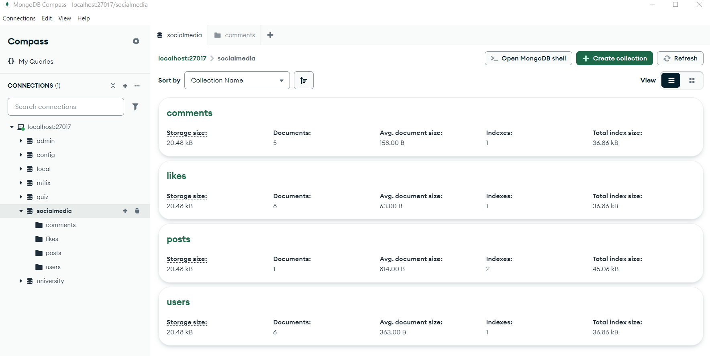
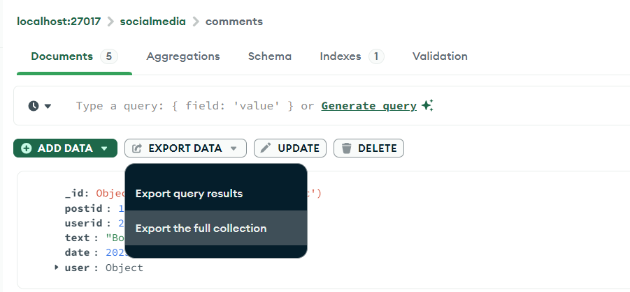
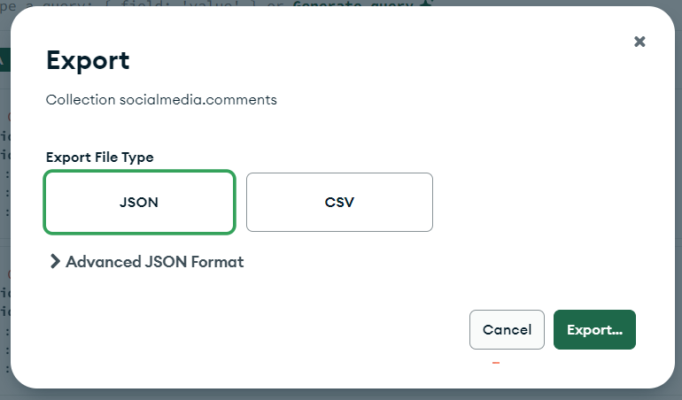
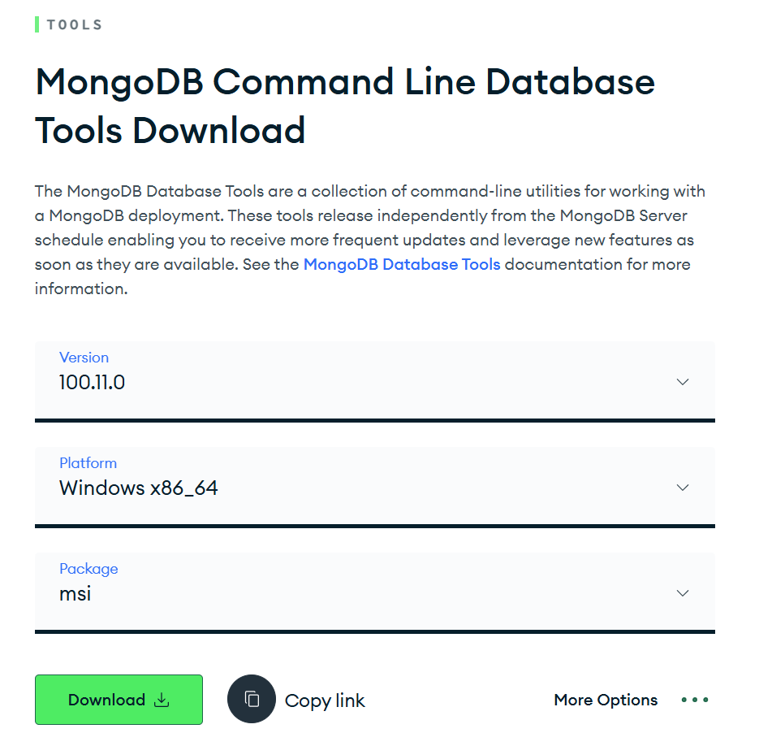
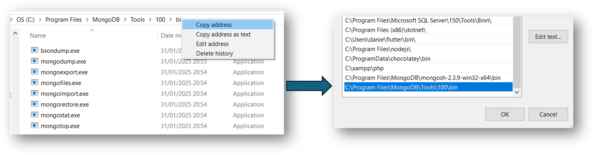

# Exporting your database

For submitting your MongoDB assignment, you'll need to export your database so that I can see what collections you've made and how you've populated them (since it's not hosted on AWS or anything like that, this is the easiest way for me to see what you've done).

## Method 1 - MongoDB Compass

Although I've said you should use **mongoexport** in the assignment specification, there is an easier way through MongoDB Compass. First, click on your database in the sidebar, then click on one of your collections.

Then, click on "EXPORT DATA", and then "Export the full collection".

Make sure 'JSON' is selected, click 'Export...' and then save it. You'll need to do this for all your collections (but hopefully this won't take long).

## Method 2 - Command Line Tools

This method might actually a bit more laborious, but it's good practice if nothing else! First go to the [MongoDB Tools page](https://www.mongodb.com/try/download/tools), and scroll down until you get to **MongoDB Command Line Database Tools**.

If you're on Windows, you can choose the '.msi' download and follow the installation wizard. You'll also need to add the location of the installation files to your system path (mine was Program Files/MongoDB/Tools/100/bin).

If you're on Mac...I'm sure you can figure it out! (Let me know if you can't, or just use the Compass method above).

Now, if you've successfully got it installed, you can simply run `mongodump --db=(your database name)` and it'll automatically store all your collections as JSON files in an ungracefully named 'dump' folder in whatever directory you were in when you ran the command!

## Whichever way you choose...
...Make sure that the JSON files for each of your collections containing all your documents are included in your submission! If you don't, I won't be able to mark your assignment properly - and you don't want that :)