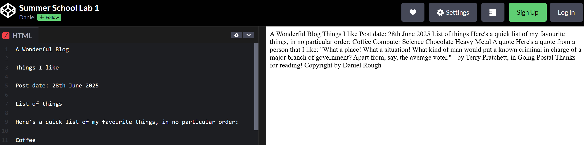

# Lab 1 - Getting started with HTML

This lab is to give you practice in understanding what HTML elements to use to structure the content of an example website. As we talked about earlier, your web browser doesn't know what to do with text that isn't wrapped in the right elements!

## What you need to do

First, <a href="https://codepen.io/Dan_Rough/pen/QwbopZy" target="_blank">open this CodePen link</a>.

On the left, in the 'HTML' window, you'll see some text I've written for a blog website with a post. On the right, you can see what this would look like in a web browser - it's a bit of a mess! All the text is clumped together and really doesn't have any structure.

I'd like you to use the HTML elements I just talked about to give this some correct structure. There is no **absolutely correct** way of doing this, but you should think about which of the elements I talked about earlier would be best for the different bits of text.

### Headings
Headings can go from h1 to h6, and are mostly used for introducing new sections of text.
For example, website titles should usually be in an h1 element, big sections of the site in h2 elements, and any subsections in h3 elements, and so on.

Here's a <a href="https://codepen.io/Dan_Rough/pen/qBQMKeV" target="_blank">link to show how to use headings</a>.

### Paragraphs
Text that could be considered 'content' (rather than a heading) should usually be in paragraph elements. Because the browser ignores any spaces in your HTML document, putting text in paragraph elements will give it the correct structure.

Here's a <a href="https://codepen.io/Dan_Rough/pen/dPoreOJ" target="_blank">link to a couple of example paragraphs</a>.

### Lists
Remember that lists can be ordered (with numbers) or unordered (with bullet points).

Here's a <a href="https://codepen.io/Dan_Rough/pen/YPXBBjy" target="_blank">link to my lists example</a>.

### Quotes
To include quotes in a document, the 'blockquote' element is used, along with the 'cite' element to indicate who wrote it and where it was written.

Here's the <a href="https://codepen.io/Dan_Rough/pen/YPXgWgE" target="_blank">link to the CodePen showing how quotes work</a>.

## Anything to submit?
There's no mandatory submission here, but I'll be going around the lab and checking in on everyone. If you would like some feedback that I didn't give during the lab, please email me at drough001@dundee.ac.uk!

## What else?
If you're done with that and want some more practice, try the following:

1. Add a link to a different page into the blog post. The 'Hyper Text' part of HTML refers to the fact that we can have links one from web page to another. Look at <a href="https://codepen.io/Dan_Rough/pen/YPXgLBR" target="_blank">this Codepen</a> to see how this might work. What does the 'target="_blank" do?

2. Add an image to the page! Without images, the web would be a bit boring. Have a look at <a href="https://codepen.io/Dan_Rough/pen/gbpEKXa" target="_blank">this Codepen</a> to see how an image can be included in a web page using HTML. The 'src' attribute should be the address of an image on the web (next time we'll look at setting up a structure where images can be stored in the same place as our HTML)

3. Add your own post that is about you, not me! This can take any form you like - it doesn't have to mirror mine.