# Lab 2 - Structuring Content

This lab is to give you practice in understanding how to structure a web page so that it can be properly understood by browsers, search engines, screen readers, and generally to make it easier for everyone to read! To do this, we make use of **semantic elements** that I talked about earlier.

When we are creating web pages it is good practice to use semantic web elements to make the page easier to be maintained in the future. More information on the semantic tags that are available within HTML can be found at <a href="https://www.w3schools.com/html/html5_semantic_elements.asp">W3Schools</a>.

## What you need to do

First, <a href="https://codepen.io/Dan_Rough/pen/xbGNVrW" target="_blank">open this CodePen link</a>.

In this activity, I would like you to attempt to add semantic tags to a pre-existing webpage. Have a look at the CSS window, you will see that I have set up style rules for the different semantic element types. These rules (which we'll cover very soon) are there to give colour to the different sections. I've also changed the font to Arial for all the elements.

Some things to consider:
1. Typically every website will have a ```<header>```, ```<main>``` content, and a ```<footer>```.
2. Remember, header elements are different to **headings** (like h1, h2, h3, etc).
3. You can have more than one ```<header>``` element in a document (for example, the website title might be in a header, but you can also have section/article titles within header elements too)
4. The difference between ```<section>``` and ```<article>``` can be confusing. A 'section' is 'a thematic grouping of content, typically with a heading'. An 'article' is 'independent, self-contained content'. So, a section can contain articles, but an article could also contain sections! Do what makes sense to you.

Once you're done with that, I'd like you to move onto setting up a real development environment.

## Setting up Visual Studio Code
So far, we've just been doing stuff in Codepen. This is quick and easy for prototyping and sharing code, but not very useful for doing any sort of real web development! For that, we need to set up a text editor that allows us to do whatever we like.

For this half of the module, I'd recommend using Visual Studio Code (VS Code). This is an excellent editor that can be used for any sort of programming, and makes writing HTML less fiddly. If you want to use something different, that's okay too. 

Here's a quick video walkthrough of the steps below (I claim it's 2 minutes but it's actually 2 minutes 36 - sorry)
<iframe src="https://dundee.cloud.panopto.eu/Panopto/Pages/Embed.aspx?id=7c4c22bb-36bf-40b0-b2a2-b30e01483b18&autoplay=false&offerviewer=true&showtitle=true&showbrand=true&captions=false&start=0&interactivity=all" height="540" width="720" style="border: 1px solid #464646;" allowfullscreen allow="autoplay" aria-label="Panopto Embedded Video Player" aria-description="Setting up Visual Studio Code" ></iframe>

### Opening it up
1. First, to open VSCode, type 'vs' in the search bar:
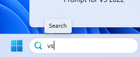
2. Then, click on 'Visual Studio Code', which should appear as the Best Match:
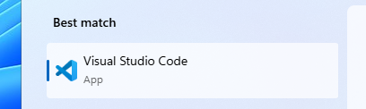

3. All being well, you should see a screen that looks like this
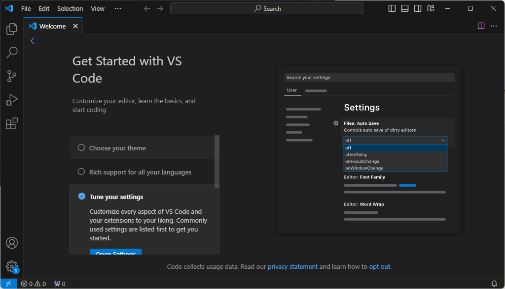

4. Click the little icon in the left sidebar that looks like two bits of paper, and then click 'Open Folder'. Here's where we'll make a place to store all our web files.
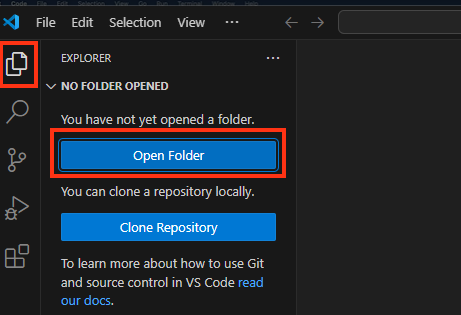

5. Navigate to your 'Documents' folder, then right-click and select New -> Folder
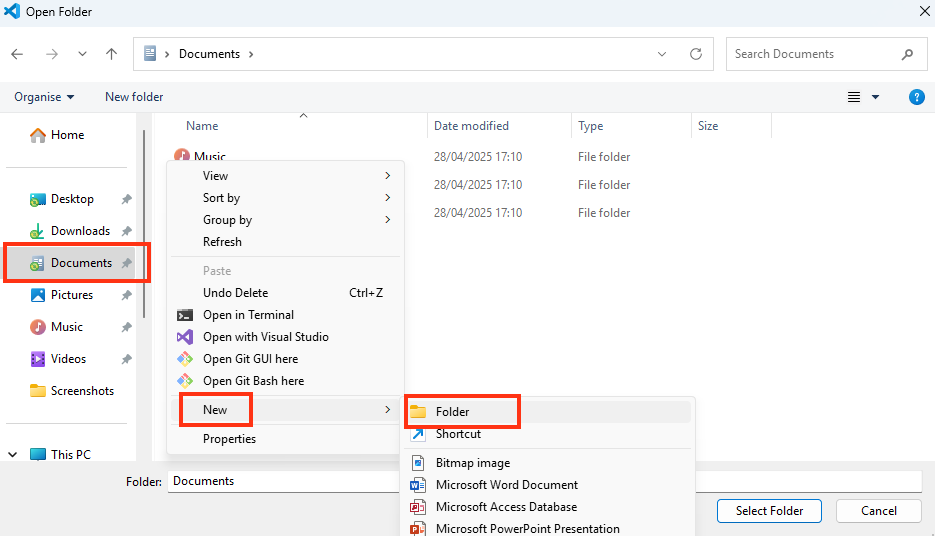

6. Give this folder a name (I've called mine daniels-project) and then click 'Select Folder'
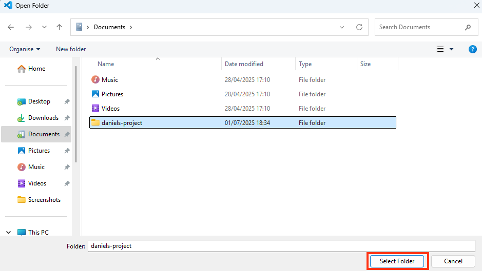

7. If you get one (or both) of the warning messages below, don't worry. Just click 'Allow' and 'Yes, I trust the authors'.
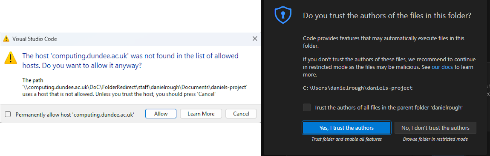

8. You should now see your folder in the 'Explorer' window. Click the 'New File' icon next to this.
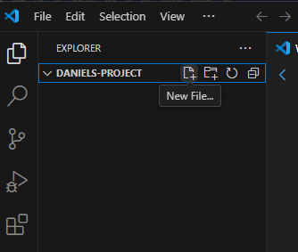

9. Give your new file the name 'index.html' - this is the 'homepage' file for all websites. 
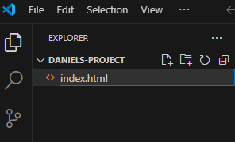

10. Now, because this is a real HTML document and not a Codepen example, we need to include all the necessary elements that come at the beginning. VSCode has a really nice feature for this, just type '!', then press Enter, and it'll create all of this for you!
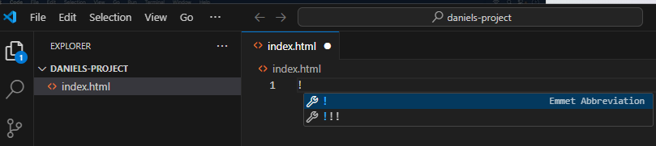
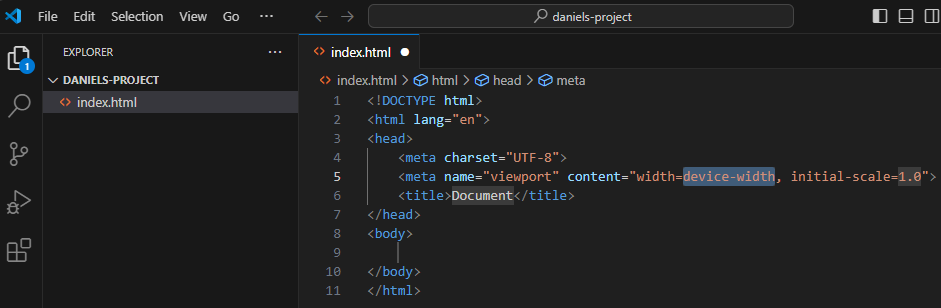

11. As I mentioned the other day, everything that we want to see on our website has to go inside the ```<body>``` tags. Write something in there and save your work (Ctrl+S).
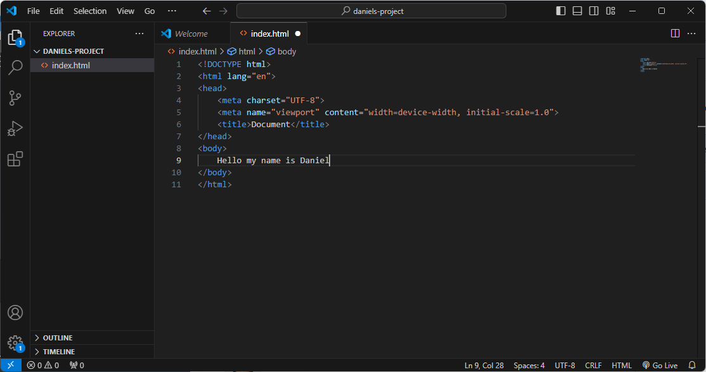

12. Now you can double-click on your new file (it should open with Microsoft Edge)
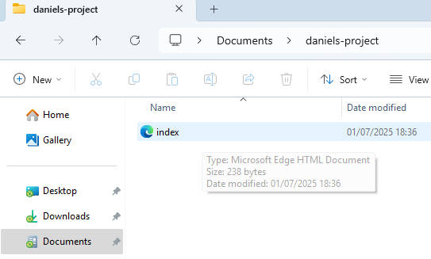

13. And there you have it, a real (although kinda boring) website!
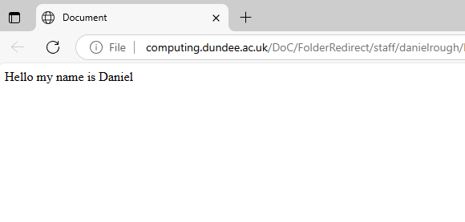

## From Codepen to reality
Let's transfer what you did in Codepen to your new web page. Copy and paste the content from Codepen in between the ```<body>``` tags, save it, and refresh your browser so that it's now displayed on your page. You should notice all the content is there, but all the pretty colours are gone! :( That's because there's no access to the CSS styling (CSS is the language we use to make our HTML look nice). Let's do that now.

### Adding CSS
In your project folder, create a new file (just like you did for index.html) and call it something like 'style.css' - the important thing is the .css part!

Now, add the following line of code in between the ```<head>``` tags at the top of your document:

```<link rel="stylesheet" href="style.css">```

This piece of code tells the HTML document that there is a link to a 'stylesheet' (your CSS file) and where to find it. Save your document and refresh the browser - hopefully you should now see the colours again!

## Now what?
While the structure of the website should be looking good by now, the styling is admittedly not great. If you're looking for something to get ahead a bit, try the following:

1. Try adding a new font using <a href="https://fonts.google.com/">Google Fonts</a>! Find a font you like, and see if you can get it to display on your HTML page.

2. Add more specificity to your styling with <a href="https://www.w3schools.com/css/css_selectors.asp">CSS Selectors</a>. For example, you can add styling to all ```<header>``` elements, but you might want specific styling for the title header element, which you can do by adding a 'class' or 'id' attribute. Have a look at the link and see if you can use the information to style a single element.

3. As well as nice fonts and colours, most websites make use of CSS for positioning elements, so that things are where you'd like them to be rather than just linearly down the page. Have a look at <a href ="https://www.w3schools.com/css/css_website_layout.asp">this link</a> to see how websites can be structured in many different ways! Can you get the 'latest posts' and 'top posts' into two separate columns?
