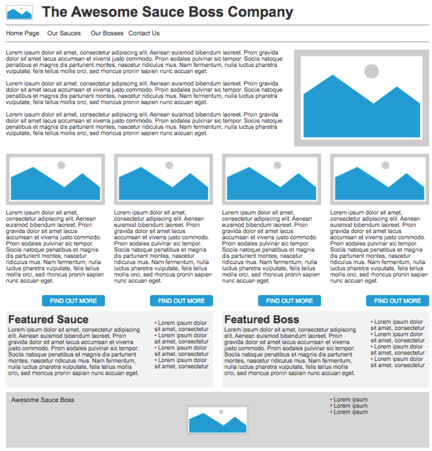

# Lab 3 - From Design to HTML

This lab is about combining your understanding of content elements and semantic elements to write HTML for a given web page design. This can be quite a daunting task at first, but once you're able to do it once, it gets much easier! It will be useful practice for your first assignment.

## What you need to do

In this activity, I would like you to look at the following website layout for "The Awesome Sauce Boss Company".

Your goal is to create HTML for this page, using appropriate semantic and content elements. There's a lot going on in this design, but we can break it down into some simpler steps:

1. Identify the biggest main parts of the website. There's a clear header, main content, and footer.
2. Look at some more specific things - within the main content, there are three clear sections, each with one or more articles.
3. Consider the header - there's a navigation bar in there too. Is there a semantic element we can use to hold this?
4. Once you've got the semantic structure nailed down, think about the different content types. There are headings, paragraphs, lists, images, and links, all of which we looked at on Monday. 

I understand this could be a tricky one. I'd really like you to have a go yourself first, but I've made a video walkthrough of how I went about it, which you can watch if you get stuck. 

<iframe src="https://dundee.cloud.panopto.eu/Panopto/Pages/Embed.aspx?id=1ece3efa-c2be-44be-ace9-b30f0151130c&autoplay=false&offerviewer=true&showtitle=true&showbrand=true&captions=false&interactivity=all" height="540" width="720" style="border: 1px solid #464646;" allowfullscreen allow="autoplay" aria-label="Panopto Embedded Video Player" aria-description="From Design to HTML - Walkthrough" ></iframe>

Remember, you **won't** be able to get it looking anything like the design with just HTML alone - that's where CSS comes in, which we'll cover more next week.

## Okay done, what now?
You can start working on your first assignment, which is available in the Assessment Area of My Dundee! 