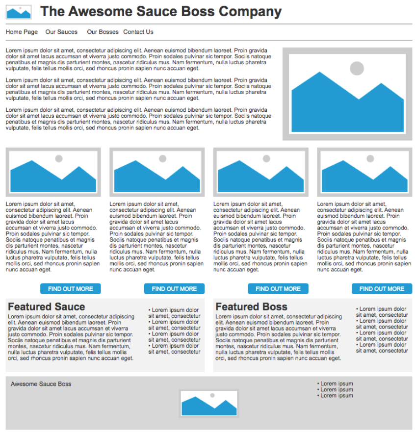

# Lab 4 - Styling our HTML

This lab is all about taking our HTML and writing CSS to arrange it in the way we would like. We'll be working with the HTML that I made last week, which I will upload so you can work along with the video and the instructions below if you'd like.

## What you need to do

In this activity, I would like you to download the 'website-files-start' ZIP folder in My Dundee, which contains our Sauce Boss HTML content, a placeholder image, and a blank CSS file. You should then extract this folder, and open it in VS Code. Our goal is to get it looking like the original design:



We're going to work through this in stages, starting from the header and working down to the footer. Try and follow along with the instructions below. I've also got a video walkthrough, which might help in some way!

<iframe src="https://dundee.cloud.panopto.eu/Panopto/Pages/Embed.aspx?id=4f1ce9c2-2bbd-453a-b67a-b312018729ce&autoplay=false&offerviewer=true&showtitle=true&showbrand=true&captions=true&interactivity=all" height="768" width="1024" style="border: 1px solid #464646;" allowfullscreen allow="autoplay" aria-label="Panopto Embedded Video Player" aria-description="CSS Styling - Made with Clipchamp" ></iframe>

### Styling the header
1. The first thing we should do is pick a nice font for our website. Go to <a href="fonts.google.com">fonts.google.com</a> and choose a font you like. I've gone with Open Sans.


Click the 'Get Font' button...


...and then the 'Get Embed Code' button


In the next screen that appears, click on '@import' and copy the line of text that is in between the 'style' tags


Then paste this into the 'style.css' file:


Now, we'll need to make a rule that says all the text in our website should have this font. Make a rule that looks like this, changing it if you've decided on a different font:

```css
body {
  font-family: "Open Sans", sans-serif;
}
```
Save the style.css file, then reload the HTML website in your browser. You should see it's now looking different!

2. Next we'll get the h1 heading in line with the header image. Add a new rule for the ```h1``` and set its display property to be ```inline-block```. This will look like this:

```css
h1 {
  display: inline-block
}
```
You should now see that they're aligned! Let's work on the nav bar now.

3. First, let's get the list elements on a single line. For this, we need the same ```display: inline-block``` but applied to the list elements. For this, we'll need the following rule:

```css
nav li {
  display: inline-block
}
```

Why not just 'li'? Well, there are other list elements in our page that we don't want to be alongside each other, so here we're saying 'only the list elements that are inside the 'nav' element. It's looking better, but you should see that there's still a bit of space to the left. This is because the 'ul' element has a preset level of padding. We can change it with a new rule in our CSS file:

```css
nav ul {
  padding-left: 0px
}
```
Again, we have to be specific that this change should **only** be made the list inside the nav element.

Now, I'd like you to add a few styles to the ```nav li``` rule:
- increase the font size to 24px
- set some padding of 8px to the top and bottom
- set padding of 40px to the right, so that the elements are nicely spread out

If you're stuck, please ask me or look at the video!

Two final touches - first, we want a nice top and bottom border for our navigation bar. Add these lines to the ```nav ul``` rule, which will make a top and bottom line across the page.

```css
border-top: 2px solid;
border-bottom: 2px solid;
```

Second, we want to remove the blue text and underline of our links. In fact, we want to do this for **all** the links in our page, so we can make a new rule that covers all ```<a>``` elements like this:

```css
a{
  text-decoration: none;
  color: black;   
}
```
The first line removes any decoration (like an underline) and the second line, more obviously, changes its colour to black!

4. Now, let's style the introduction. To get the text and images next to each other, we can use a flex box! In fact, we'll be using flex boxes a lot in this page, so let's make a new class for this. Go into the **index.html** file, and add ```class="flex-container"``` to the article inside the 'intro' section. It should look like this:

```html
<section id="intro">
  <article class="flex-container">
```

Of course, this won't do anything without a CSS rule to say what the flex-container does! So let's go back to the **style.css** file and make the following rule:

```css
.flex-container{
  display:flex;
}
```
This means that any element with the class 'flex-container' will display its children flexibly, like I mentioned earlier! Refresh your page, and you should probably see something that looks like this:


Hm, not ideal. It's taken all three of our paragraphs, and our image, and distributed them evenly. What we'd *like* is for all the paragraphs to be considered as a single element. We can do this by wrapping them all in another element, like a ```<div>```! 


Wrap your ```<p>``` elements in a ```<div>```, refresh the page, and hopefully you'll see something much better!


All done (hopefully!). Now we can move onto the four articles underneath.

5. Luckily, everything we've covered so far almost completely sets us up for the rest of the site. Let's move onto the four articles inside the 'newsitems' section. The first thing we need to do is add ```class="flex-container"``` to this section, so that the contained articles are spread across evenly (try this yourself, but look at the video if you're not sure).

First, let's style the 'Find out more' links at the bottom of each article. Make a new CSS rule for links inside an article, like this:

```css
.news a{
  float:right;
}
```
This 'float' rule forces the content to the right. That's all fine, but we need to make the link look more like a button. I've added some CSS below, but haven't filled in the properties:

```css
 float:right;
  background-color: ??;
  color: ??;
  text-transform: ??;
  padding: ?px ?px ?px ?px;
  border-radius: ??;
  margin-right: ??;
```
Try to find a background colour, text colour, text transform (hint - add 'text-transform' into your CSS file in VS Code and see what options come up!), padding and border-radius (to make it look like a slightly rounded button), and a margin-right (so that it's not fully to the right), that makes it look like the example image.

There are a couple of additional things needed to make this look better. First, the articles are too close together, and they're also too close to the introduction. We can solve this with a single CSS rule that looks like this:

```css
#newsitems{
  gap:40px;
  margin-top: 30px;
}
```

The 'gap' property is something we can apply to flex boxes to control the horizontal (and vertical) spacing between their contents. The 'margin-top' property is just a simple way to push the whole section down a bit.

6. Okay, let's have a look at the 'Featured' articles (the Featured Sauce and Featured Boss). Add the ```class="flex-container"``` to the surrounding section, so that they are side-by-side.

Although they should now be in the right place, the list is still below the paragraphs, but they should also be side-by-side. Again, we can make use of the ```class="flex-container"``` but on the **content** of the articles. Try to add this class to the correct element. 

Once you've done this, you should find that the paragraph is taking up too much room and the list is squished to the right. There are a couple of ways to fix this, but the easiest way is to make a new CSS rule for this list with the property ```width=150%```. This will give the list more space within the container.

Finally, add a light gray background colour to each of the articles using a CSS rule, and add a gap/margin in the same way as in the previous section.

7. We've just got to style our footer now! Once again, should also be a ```class="flex-container"``` element, so that we can evenly distribute the company name, image, and list across the footer. Add this to the ```<footer>``` tag, and see what happens. You should see something like this:


As you can see, the title, image, and list are all squished together. We don't want this, and there are various ways of spacing out content in a flex container. The one I would suggest using is ```justify-content: space-between;``` which will put the company name at the left, the list at the right, and the image in the middle.


All that needs to be done now is add a background colour, and a margin to the top to separate it from the section above. 

## What now?
Now that you've had some practice using CSS, please continue working on your first assignment.