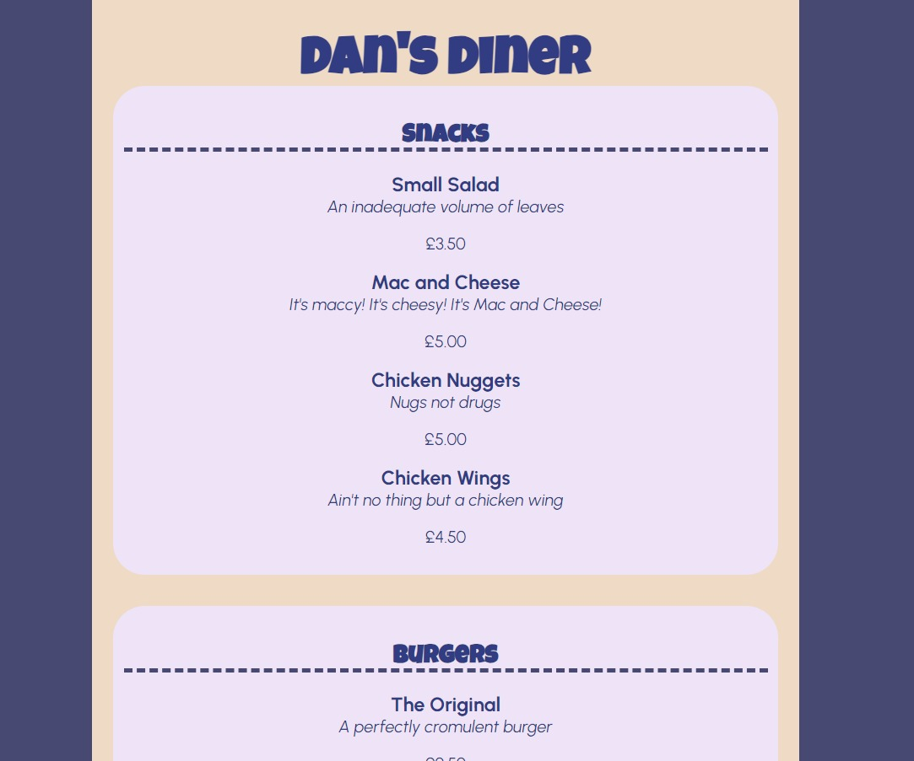

# Lab 5 - A bit more styling

This lab is a follow-on from Monday's lab, and is intended to give you a bit more practice in taking HTML and translating it into an example design. This is optional, as I would also like you to be working on your assignment, but please give this a go if you'd like some more practice!

## What you need to do

In this activity, I would like you to download the 'menu.html' file in My Dundee, and load it into VS Code. The goal here is to create a CSS file that gets the content looking like this:

Of course, you don't have to get it looking **exactly** like this, but please do give it a try! Oddly enough, this one doesn't require *any* flex containers, since the content is very much top-to-bottom with no sidebars. If you get stuck, I've included the final CSS file on My Dundee, but please try it yourself first. :)

## What now?
Please do crack on with your first assignment! If you're looking to do something more advanced, here are some resources that I'd recommend:

<a href="https://fontawesome.com/">Font Awesome</a> - this has a few style icons that can be added to your page.

<a href="https://animate.style/">Animate.css</a> - a nice library for adding animations to your CSS (please use sparingly - no one wants an excessively animated web page).

